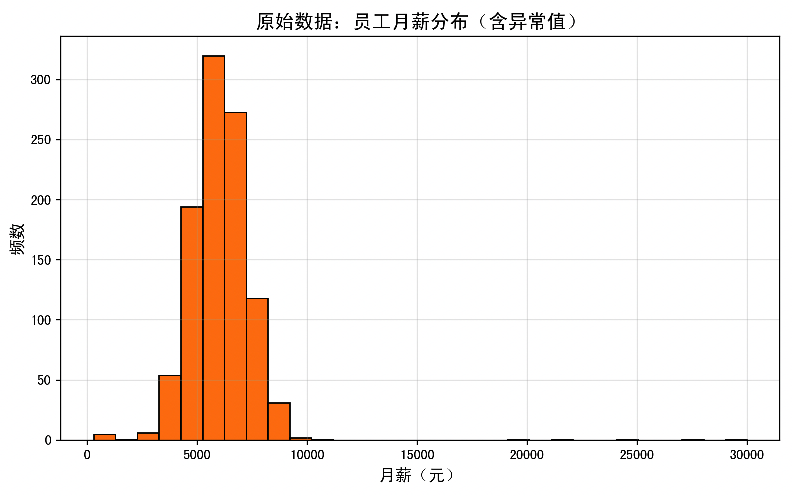
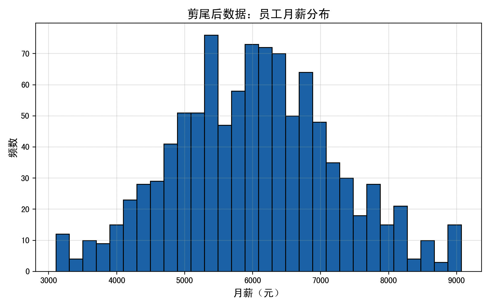

> 这一页重新梳理 剪尾法 的判断规则和处理思路，尽量让读者先看懂“为什么”，再看“怎么做”。

## 快速理解
- 先判断点位是不是明显偏离主体分布。
- 再决定是删除、替换、截断还是分组处理。
- 处理后最好再检查分布是否更稳。

## 核心机制

### 1. 剪尾法的定义

设你的数据集是一个有 $n$ 个样本的序列：

$X = \{x_1, x_2, \ldots, x_n\}$

设定一个**剪尾比例** $\alpha \in (0, 0.5)$（常用 0.05 或 0.01，即 5% 或 1%）。

然后我们找到：

- 下 $\alpha$ 分位数：$q_{\alpha}$，也叫**第 **$\alpha$** 百分位数**

- 上 $(1-\alpha)$ 分位数：$q_{1-\alpha}$，也叫**第 **$(1-\alpha)$** 百分位数**

然后我们做如下处理：

$x_i^{*} =\begin{cases}q_{\alpha}, & x_i < q_{\alpha} \\x_i, & q_{\alpha} \le x_i \le q_{1-\alpha} \\q_{1-\alpha}, & x_i > q_{1-\alpha}\end{cases}$

这就是剪尾法的数学定义：把太小的值替换成“第 $\alpha$ 百分位数”，太大的值替换成“第 $1-\alpha$ 百分位数”。

### 2. 剪尾与截断的区别

|方法|名称|说明|
|---|---|---|
|Winsorizing（剪尾）|替换|把极端值**替换**为边界值|
|Trimming（截断）|删除|把极端值**直接删除**|

剪尾更温和一些，适合不想删数据的情况。

### 3. 例如

假设你有如下数据（10个数）：

```Plaintext
[10, 12, 14, 15, 16, 18, 20, 25, 100, 150]
```

我们设定剪尾比例 $\alpha = 0.1$（即 10%）

- 第 10% 分位数：排好序后第一个数，$q_{0.1} = 11$（假设线性插值得来）

- 第 90% 分位数：$q_{0.9} = 90$

剪尾后变成：

```Plaintext
[11, 12, 14, 15, 16, 18, 20, 25, 90, 90]
```

- 10 → 11（被剪尾）

- 100 和 150 → 都变成 90（被剪尾）

## 剪尾法的算法流程

我们以一维数组为例，来分步骤说明：

**步骤一：确定剪尾比例 α**

- 常用：α = 0.01（1%剪尾）、0.05（5%剪尾）

**步骤二：计算上下分位数**

- 排序你的数据集：$X_{\text{sorted}}$

- 找出：

    - 第 $\alpha$ 分位数（$q_{\alpha}$）

    - 第 $1 - \alpha$ 分位数（$q_{1 - \alpha}$）

这两个分位数可以用分位数公式来计算：

$q_{\alpha} = X_{\text{sorted}}[\lceil n \cdot \alpha \rceil]$

$q_{1 - \alpha} = X_{\text{sorted}}[\lfloor n \cdot (1 - \alpha) \rfloor]$

**步骤三：替换极端值**

对每个数据 $x_i$ 进行如下处理：

- 如果 $x_i < q_{\alpha}$，则用 $q_{\alpha}$ 替代

- 如果 $x_i > q_{1-\alpha}$，则用 $q_{1-\alpha}$ 替代

- 否则保留 $x_i$ 不变

**步骤四：输出新的剪尾后数据**

数据中最小和最大极值已被“压缩”，极端值对均值等统计量的影响大大降低。

## 完整例子

### 1. 例子背景

- **场景**：某公司人力资源部分析员工月薪分布，希望剔除或缓和极端异常值对统计指标（如均值、方差）的影响，以获得更稳定的薪酬水平分析结果。

- **数据**：共 1,010 名「员工」月薪，正常员工月薪服从均值 6,000 元、标准差 1,200 元的正态分布；为了模拟极端情况，额外加入 5 个极端偏低值（300–700 元）和 5 个极端偏高值（20,000–30,000 元）。

#### 整体结构

1. 构造并展示原始数据

2. 计算分位数（1% 和 99%）

3. 应用剪尾法

4. 展示剪尾前后分布对比

5. 输出分位数结果

6. 算法拆解与公式推导

7. 该例子下剪尾法的优缺点及优选场景讨论

```Python
import numpy as np
import pandas as pd
import matplotlib.pyplot as plt

# 1. 构造模拟数据：员工月薪（单位：元）
np.random.seed(42)
normal_salaries = np.random.normal(loc=6000, scale=1200, size=1000)
outliers_low  = np.array([300, 400, 500, 600, 700])
outliers_high = np.array([20000, 22000, 25000, 28000, 30000])
salaries = np.concatenate([normal_salaries, outliers_low, outliers_high])
df = pd.DataFrame({'salary': salaries})

# 2. 可视化：原始数据分布
plt.figure(figsize=(8, 5))
plt.hist(df['salary'], bins=30, color='tab:orange', edgecolor='black')
plt.title('原始数据：员工月薪分布（含异常值）', fontsize=14)
plt.xlabel('月薪（元）', fontsize=12)
plt.ylabel('频数', fontsize=12)
plt.grid(alpha=0.3)
plt.tight_layout()
plt.show()

# 3. 计算 1% 和 99% 分位数
alpha   = 0.01
lower_q = df['salary'].quantile(alpha)
upper_q = df['salary'].quantile(1 - alpha)

# 4. 剪尾：替换极端值
df['salary_winsorized'] = df['salary'].clip(lower=lower_q, upper=upper_q)

# 5. 可视化：剪尾后数据分布
plt.figure(figsize=(8, 5))
plt.hist(df['salary_winsorized'], bins=30, color='tab:blue', edgecolor='black')
plt.title('剪尾后数据：员工月薪分布', fontsize=14)
plt.xlabel('月薪（元）', fontsize=12)
plt.ylabel('频数', fontsize=12)
plt.grid(alpha=0.3)
plt.tight_layout()
plt.show()

# 6. 输出分位数
quantiles = pd.Series({'1% 分位数': lower_q, '99% 分位数': upper_q})
print(quantiles)
```

### 2. 代码每一步骤详解

#### 构造模拟数据

- 使用 `np.random.normal(loc=6000, scale=1200, size=1000)` 生成 1,000 个近似正态分布的月薪数据（均值 6,000、标准差 1,200）。

- 手动添加 5 个极低值和 5 个极高值，以模拟真实场景中可能出现的**录入错误**或**极端岗位**数据。

- 最后数据长度：1,010 条。

#### 原始数据分布可视化

- 使用 `matplotlib.pyplot.hist` 绘制直方图。

- 从直方图可以看到：大多数员工月薪集中在 3,000–9,000 元区间，但在 20,000 元以上存在明显尖峰。



#### 计算分位数

- 设剪尾比例 $\alpha=1%$（典型值也可取 5%）。

- 使用 Pandas 的 `quantile()` 方法分别计算第 1% 分位数 $q_{0.01}$ 和第 99% 分位数 $q_{0.99}$。

- 这两个值对应「将被替换的边界」。

#### 应用剪尾法

- 机制：

$x_i^* =\begin{cases}q_{\alpha}, & x_i < q_{\alpha} \\x_i, & q_{\alpha} \le x_i \le q_{1-\alpha} \\q_{1-\alpha}, & x_i > q_{1-\alpha}\end{cases}$

- 在 Pandas 中直接用 `clip(lower=lower_q, upper=upper_q)` 即可完成替换操作：

    - 小于 $q_{0.01}$ 的值全部变成 $q_{0.01}$

    - 大于 $q_{0.99}$ 的值全部变成 $q_{0.99}$

#### 剪尾后数据分布可视化

- 同样用直方图展示处理后的分布。

- 主体分布几乎不变，但尾部被“钝化”，均值和方差受极端点干扰大幅减少。



#### 分位数结果

打印出的第 1% 和第 99% 分位数分别是：

```Plaintext
1% 分位数     3104.516290
99% 分位数    9068.521018
```

说明：

- 所有低于 3,104.52 元的观测值都被“抬高”到 3,104.52 元

- 所有高于 9,068.52 元的观测值都被“压低”到 9,068.52 元

### 3. 剪尾法公式与机制回顾

1. **分位数定义**

    - 第 $\alpha$ 分位数 $q_{\alpha}$：有 $\alpha \times 100%$ 的数据不大于它。

    - 第 $(1-\alpha)$ 分位数 $q_{1-\alpha}$：有 $(1-\alpha)\times 100%$ 的数据不大于它。

2. **剪尾替换公式**

$x_i^{*} =\begin{cases}q_{\alpha}, & x_i < q_{\alpha}, \\x_i, & q_{\alpha} \le x_i \le q_{1-\alpha}, \\q_{1-\alpha}, & x_i > q_{1-\alpha}.\end{cases}$

3. **为何降低极端影响**

    - 极端值对均值和方差的贡献通常是与其距离有关，距离越远贡献越大。

    - 剪尾后，所有尾部观测统一成边界分位数，因此最大距离被限幅。

---

### 4. 优缺点分析与适用场景

**优点**：

- **保留全部样本**：不像截断法直接删除数据，剪尾法仅“压平”极端值，对样本总量零损耗。

- **减少统计偏移**：在均值、方差等敏感指标上，将极端点的拉动效应减到最小。

- **简单易实现**：通过计算分位数和调用一次 `clip` 即可，且无需复杂参数调优。

- **模型鲁棒性提升**：后续建模时，异常点不至于成为影响模型收敛或预测精度的大牛刀。

**缺点**：

- **信息损失**：将所有尾部值映射为同一边界数值，细粒度信息消失；若这些极端点本身含有业务价值，则被“钝化”后丢失。

- **分布形状改变**：原本可能长尾分布，经过剪尾，尾部形态被截断或变平，影响分布假设；若后续需分析尾部行为（如风险控制），不宜使用。

- **边界选择主观**：剪尾比例 $\alpha$ 需人工指定，不同 $\alpha$ 对结果影响较大；如果设得不当，可能过度压平或不足以缓和异常。

**适用场景**：

- **关心总体指标**：例如财务报表中关心平均成本、平均收益，而非个别异常天的指标。

- **数据呈长尾但极端点非重点**：营销数据、电商客户消费金额，经常是长尾分布，但极端高价订单对整体均值拉高须处理。

- **建模前预处理**：线性模型、K-Means 聚类、PCA 等对异常值敏感的算法，剪尾能使训练更稳定。

- **样本不足不宜删除**：当数据量本来就小，删除异常值会造成样本量显著减少，剪尾提供了替代方案。

## 总结

在实际应用中，建议结合业务需求合理选取 $\alpha$，并与其它异常值处理方法（如 IQR 法、Z-Score 法）进行对比，确保处理方案既符合统计学严谨性，又满足业务可解释性。