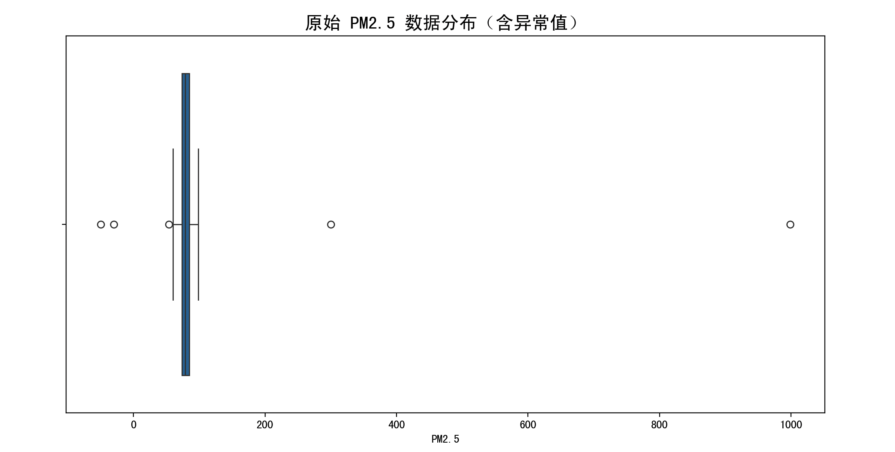
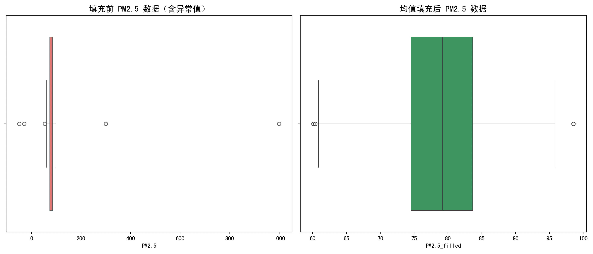

> 这一页重新梳理 均值填充 的判断规则和处理思路，尽量让读者先看懂“为什么”，再看“怎么做”。

## 快速理解
- 先判断点位是不是明显偏离主体分布。
- 再决定是删除、替换、截断还是分组处理。
- 处理后最好再检查分布是否更稳。

## 完整例子

我们使用一个模拟的「城市空气质量监测数据集」，其中包含多个城市的 PM2.5 浓度数据。由于某些设备故障、数据上传错误或极端天气，可能会出现**异常的 PM2.5 数值**（如特别高或负数），这会影响后续的分析。

目标是：使用「均值填充法」检测并处理 PM2.5 的异常值，使得数据更加稳定，适用于后续建模。

### 加载与可视化数据

模拟一组数据，其中故意加入了一些异常值（例如 -50、999）。

```Python
import numpy as np
import pandas as pd
import matplotlib.pyplot as plt
import seaborn as sns

# 模拟数据
np.random.seed(42)
normal_data = np.random.normal(loc=80, scale=10, size=100)   # 正常的 PM2.5 数据
outliers = np.array([-50, 300, 999, -30])                     # 加入异常值
pm25_data = np.concatenate([normal_data, outliers])
df = pd.DataFrame({'PM2.5': pm25_data})

# 原始数据可视化
plt.figure(figsize=(12, 6))
sns.boxplot(data=df, x='PM2.5')
plt.title('原始 PM2.5 数据分布（含异常值）', fontsize=16)
plt.show()
```



### 异常值检测（使用 IQR 方法）

我们采用**四分位距法（IQR）**来识别异常值。

```Python
# 计算 IQR 边界
Q1 = df['PM2.5'].quantile(0.25)
Q3 = df['PM2.5'].quantile(0.75)
IQR = Q3 - Q1

# 设置上下限
lower_bound = Q1 - 1.5 * IQR
upper_bound = Q3 + 1.5 * IQR

# 标记异常值
df['is_outlier'] = (df['PM2.5'] < lower_bound) | (df['PM2.5'] > upper_bound)

print("异常值列表：")
print(df[df['is_outlier']])
```

### 均值填充异常值

我们计算“非异常值”的均值，并用它来替换异常值。

```Python
# 提取非异常数据
normal_values = df.loc[~df['is_outlier'], 'PM2.5']
mean_value = normal_values.mean()

# 创建一个新的列，填充后的数据
df['PM2.5_filled'] = df.apply(
    lambda row: mean_value if row['is_outlier'] else row['PM2.5'], axis=1
)
```

### 对比分析（填充前后）

下面我们绘制两个对比图，观察填充前后数据的变化：

```Python
# 原始数据 vs 均值填充数据
plt.figure(figsize=(14, 6))

# 原始数据
plt.subplot(1, 2, 1)
sns.boxplot(x=df['PM2.5'], color="salmon")
plt.title("填充前 PM2.5 数据（含异常值）", fontsize=14)

# 均值填充后的数据
plt.subplot(1, 2, 2)
sns.boxplot(x=df['PM2.5_filled'], color="mediumseagreen")
plt.title("均值填充后 PM2.5 数据", fontsize=14)

plt.tight_layout()
plt.show()
```



**数据生成与可视化**：

我们使用 `numpy.random.normal()` 来生成符合正态分布的 PM2.5 数据（平均为 80，标准差为 10），然后加入 4 个异常值：

- `-50`, `-30`（可能是设备错误）

- `300`, `999`（可能是极端污染或输入错误）

可视化使用 seaborn 的 `boxplot`，非常适合观察异常值。

**异常值检测（IQR法）**：

**四分位距法（Interquartile Range, IQR）**是一种稳健的统计方法，它不受极端值影响，适合识别异常值。

计算方式如下：

$\text{IQR} = Q3 - Q1$

$\text{下界} = Q1 - 1.5 \cdot \text{IQR}$

$\text{上界} = Q3 + 1.5 \cdot \text{IQR}$

凡是小于下界或大于上界的值都被认为是异常。

**均值填充**：

使用非异常值计算均值：

```Python
mean_value = normal_values.mean()
```

然后通过 `apply()` 函数实现条件替换，逻辑如下：

- 如果当前行为异常值 → 替换为均值

- 否则保留原值

这一步非常关键，体现了“均值填充”的关键思路。

**可视化对比**：

我们再次使用 boxplot 来对比处理前后的数据分布，观察：

- 异常值是否被清除？

- 数据分布是否更加集中？

### 均值填充法的优点和缺点

**优点**：

1. **简单易用**：算法直观、计算量小，非常适合初学者和快速预处理。

2. **保持样本数量不变**：不会像“删除法”那样直接丢弃数据，避免了信息损失。

3. **适用于偏态较小的数据**：如果数据总体是“正态分布”或“近似正态”，均值是非常好的代表值。

4. **易于集成到模型管道中**：尤其适合在训练前统一填补空缺或异常项。

**缺点**：

1. **可能扭曲数据分布**：对偏态数据或多峰数据，均值未必是好的代表，可能会降低模型性能。

2. **降低方差，增加相似性**：用一个固定值填充会导致数据变得“太一致”，让模型更容易捕捉不到原始差异。

3. **忽略了数据生成机制**：如果异常值有意义（如突发污染事件），均值填充可能掩盖了重要信息。

4. **对高度非线性模型不友好**：在深度学习或时间序列中，这种简单填充可能带来信息偏移。

### 适合使用均值填充的场景

均值填充不是“万能药”，但它适合以下几种情形：

- **小规模异常**：异常值占比很少，不是系统性错误。

- **数据近似正态分布**：中位数与均值差不多的情况。

- **模型不太依赖极端波动**：如线性回归、决策树初级模型。

- **任务对数据真实性要求不高**：如简单可视化、教学演示或快速原型。

## 总结

虽然均值填充方法简单，但在实际项目中仍有其一定的价值，特别是在模型初期开发或需要快速清洗数据的阶段，是一种“快速、安全”的手段。不过，对于更精细的任务，大家要结合其他方法（如插值、模型预测填充）一起使用。