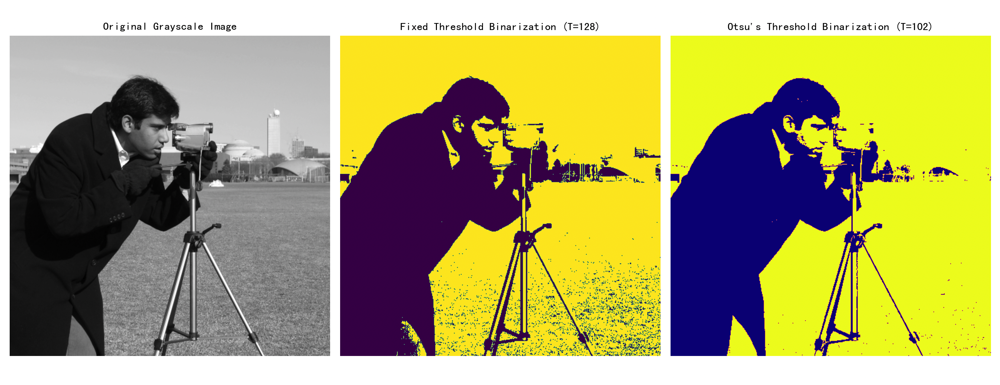

# 二值化

## 快速理解

这一小节，我们来把 归一化方法方面的二值化，详细的和大家聊聊~

### 什么是二值化？

核心思想：把“复杂、多样”的数值，变成“只剩下两个选项”的简单数据。

比如原始数据可以是：

- 身高（178cm）

- 分数（95分）

- 年龄（23岁）

但我们在处理时，只关心它是不是“高”、“及格”、“成年”，就可以把它变成：

- 是（1）或 否（0）

这就是“**二值化**”。

### 为什么要用二值化？

1. **简化问题**：复杂的数字信息 → 简单的“是否”判断。

2. **方便模型处理**：有些机器学习模型处理布尔值（0或1）更高效。

3. **用于分类任务**：把原始数据转成“类别标签”。

## 二值化的基本构成

我们来从最基本的结构开始：

- 数据点：$x$（原始数据）

- 阈值：$T$（你设置的一个临界值）

- 输出：$x'$（二值化后的结果，只可能是0或1）

### 二值化数学定义

$x' = \begin{cases}1, & x \geq T \quad\text{（满足条件）} \\0, & x < T \quad\text{（不满足条件）}\end{cases}$- 如果$x$的值大于或等于你设置的那个“门槛”$T$，那么你认为这个数据“够格” → 用 **1** 表示；

- 否则你认为“不过关” → 用 **0** 表示。

### 举个最简单的例子

原始数据：学生分数：$x = [45, 59, 60, 77, 90]$设定及格线为：$T = 60$

执行判断：

|原始分数 $x$|判断$x \geq 60?$|二值化结果$x'$|
|---|---|---|
|45|否|0|
|59|否|0|
|60|是|1|
|77|是|1|
|90|是|1|

最终结果：$x' = [0, 0, 1, 1, 1]$

## 从归一化的角度来理解二值化

归一化是把不同“量级”的数据统一到一个标准范围里（比如 0~1）。

常见的归一化公式是：

$x' = \frac{x - \min(x)}{\max(x) - \min(x)}$

它的目标是让所有数据 **在相对尺度上公平对比**。

### 从广义预处理角度理解二值化

- 它不关心 **值到底是多少**；

- 它只关心你 **有没有超过某个值**。

就像：

- 原始数据有 0~100 的范围，

- 二值化后就只剩 **两个值：0 或 1**。严格来说，它属于阈值离散化，而不是保留连续尺度的归一化。

## 数学原理

我们来用一个完整的数学视角，把二值化的本质推导一遍。

### 1. 原始数据：一组实数

$x = [x_1, x_2, ..., x_n]$比如说：$x = [0.2, 0.5, 0.8, 0.9]$### 2. 设定一个阈值$T$

这个阈值是你认为“分类标准线”。

比如：$T = 0.7$

### 3. 定义一个指示函数

数学上我们用：

$\delta(x_i) =\begin{cases}1, & x_i \geq T \\0, & x_i < T\end{cases}$这个函数$\delta(x_i)$ 就是核心的“判断逻辑”：是否超过阈值。

### 4. 得到二值化结果

把所有 $x_i$依次代入：$x_1 = 0.2 \Rightarrow 0.2 < 0.7 \Rightarrow x'_1 = 0$

$x_2 = 0.5 \Rightarrow 0.5 < 0.7 \Rightarrow x'_2 = 0$

$x_3 = 0.8 \Rightarrow 0.8 \geq 0.7 \Rightarrow x'_3 = 1$

$x_4 = 0.9 \Rightarrow 0.9 \geq 0.7 \Rightarrow x'_4 = 1$最终结果：$x' = [0, 0, 1, 1]$

## 算法流程

我们现在把执行过程像“机器操作一样”分解，清晰每一步怎么做：

### 步骤 1：准备数据

输入一组数，例如：

$x = [x_1, x_2, x_3, ..., x_n]$例子：$x = [20, 35, 50, 65, 80]$### 步骤 2：设定一个阈值$T$比如我们设：$T = 50$

### 步骤 3：逐个判断并生成新值

对于每个 $x_i$：

- 如果 $x_i \geq T$，输出 1；

- 如果 $x_i < T$，输出 0。

### 步骤 4：记录结果

把所有判断后的值记录到一个新的列表中：

$x_1 = 20 \Rightarrow 0$

$x_2 = 35 \Rightarrow 0$

$x_3 = 50 \Rightarrow 1$

$x_4 = 65 \Rightarrow 1$

$x_5 = 80 \Rightarrow 1$最终结果：$x' = [0, 0, 1, 1, 1]$

总之，二值化是一种极简的归一化：把数据简化成 0 或 1，本质是一个“条件判断”：有没有超过某个阈值；数学形式是一个“阶梯函数”或“指示函数”，在数据处理、分类、图像黑白处理等方面很常用。

## 完整案例

在文档扫描、图像预处理、OCR（文字识别）等任务中，常需要将灰度图像转换为黑白图像，去除灰度噪声，突出文字或目标物体。二值化正是最基本、常用的预处理技术。

代码实现：

```python
import matplotlib.pyplot as plt
from skimage import data, color
from skimage.filters import threshold_otsu
import numpy as np

# 1. 读取一张样例灰度图像
image = data.camera()  # skimage 自带的摄影师和三脚架照片

# 2. 固定阈值二值化
fixed_thresh = 128
binary_fixed = image >= fixed_thresh

# 3. Otsu 自适应阈值二值化
otsu_thresh = threshold_otsu(image)
binary_otsu = image >= otsu_thresh

# 4. 可视化对比：原图 / 固定阈值 / Otsu 方法
fig, axes = plt.subplots(1, 3, figsize=(15, 5))
ax = axes.ravel()

ax[0].imshow(image, cmap='gray')
ax[0].set_title("Original Grayscale Image")
ax[0].axis('off')

ax[1].imshow(binary_fixed, cmap='viridis')
ax[1].set_title(f"Fixed Threshold Binarization (T={fixed_thresh})")
ax[1].axis('off')

ax[2].imshow(binary_otsu, cmap='plasma')
ax[2].set_title(f"Otsu's Threshold Binarization (T={otsu_thresh})")
ax[2].axis('off')

plt.tight_layout()
plt.show()
```

1. 第一幅图：原始灰度图（0–255）。

2. 第二幅图：固定阈值二值化（阈值 T=128），低于 128 的部分显示深紫色，高于等于 128 显示亮黄色。

3. 第三幅图：Otsu 方法自动计算阈值（本例约为 102），用深蓝与亮黄对比。



### 代码详解

#### 1. 读取并准备原始灰度图像

```python
image = data.camera()
```

- `image`：一个 512×512 的二维数组，每个元素范围在 0~255，代表灰度强度。

- 我们选择这张经典的“摄影师拿三脚架”照片，作为演示对象。

### 2. 固定阈值二值化

```python
fixed_thresh = 128
binary_fixed = image >= fixed_thresh
```

**固定阈值**：人为设定 `T=128`，这是灰度范围中点。

`image >= fixed_thresh`：将原图每个像素值与 128 比较，生成布尔数组（True/False），再转为二值（1/0）。

- 如果 ≥128 → True → 在可视化时被映射为“1”（亮色）。

- 如果 \<128 → False → 映射为“0”（暗色）。

### 3. Otsu 自适应阈值二值化

```python
otsu_thresh = threshold_otsu(image)
binary_otsu = image >= otsu_thresh
```

- **Otsu 方法**：自动根据图像灰度直方图寻找将类内方差最小化的最佳阈值。

- `threshold_otsu(image)` 返回一个整数阈值，本例约为 102。

- 接着同样比较生成二值图。

### 4. 可视化对比

```python
fig, axes = plt.subplots(1, 3, figsize=(15, 5))
ax = axes.ravel()

# 原图
ax[0].imshow(image, cmap='gray')
ax[0].set_title("Original Grayscale Image")
ax[0].axis('off')

# 固定阈值结果
ax[1].imshow(binary_fixed, cmap='viridis')
ax[1].set_title(f"Fixed Threshold Binarization (T={fixed_thresh})")
ax[1].axis('off')

# Otsu 方法结果
ax[2].imshow(binary_otsu, cmap='plasma')
ax[2].set_title(f"Otsu's Threshold Binarization (T={otsu_thresh})")
ax[2].axis('off')

plt.tight_layout()
plt.show()
```

- **plt.subplots**：创建 1×3 的子图。

- **imshow(..., cmap=...)**：指定不同的伪彩色映射，让结果视觉对比更加清晰。

    - `gray`：灰度原图

    - `viridis`、`plasma`：Matplotlib 自带的亮色映射，凸显前景与背景的对比。

- `axis('off')`：去掉坐标轴以简化视图。

### 分析与讨论

#### 1. 固定阈值法：优缺点

**优点**

- 实现简单：只需一个固定数字。

- 计算效率高：比较运算 O(N)。

- 可控性好：当你明确知道图像整体亮度范围时，可以精确调整。

**缺点**

- 对“光照不均”或“对比度弱”场景鲁棒性差。

- 单一阈值无法应对局部阴影、反光等复杂情况。

- 手动选择阈值耗时且主观。

#### 2. Otsu 自适应阈值法：优缺点

**优点**

- 自动寻优：无需人工设定，适合批量处理。

- 对于双峰分布的灰度直方图效果尤佳（前景/背景明显分离）。

- 抗一定程度的灰度噪声。

**缺点**

- 计算量相对固定阈值略高（虽仍是 O(N) 但存在直方图计算和类内方差优化）。

- 对于分布不明显双峰或目标非常细小场景，效果可能欠佳。

- 无法处理局部自适应需求（比如图像不同区域光照有很大差异时）。

### 何时优选二值化方法

1. **预处理 OCR**：对文档扫描件，背景干净且对比度较好，二值化能显著提升文字识别率。

2. **目标检测**：在标定环境（光照均匀、背景单一）中快速分割目标。

3. **图像压缩与存储**：黑白二值图可大幅减少存储空间（1 bit/pixel）。

4. **工业检测**：高速相机采集流水线物体，二值化后可更快检测缺陷或计数。

**不适合**：光照复杂、目标与背景灰度重叠严重、需要保留丰富灰度信息或颜色信息的场景。

## 总结

总体来说：二值化是最简单的归一化方法，将连续灰度转换为黑白两级。

**阈值选择**：决定处理效果，固定阈值适合已知场景，Otsu 更具通用性。

**应用场景**：OCR、简单分割、工业检测、节省存储等。

**局限性**：光照依赖强，无法保留细腻灰度，需结合其他预处理手段（均衡化、滤波、形态学操作）共同使用。
