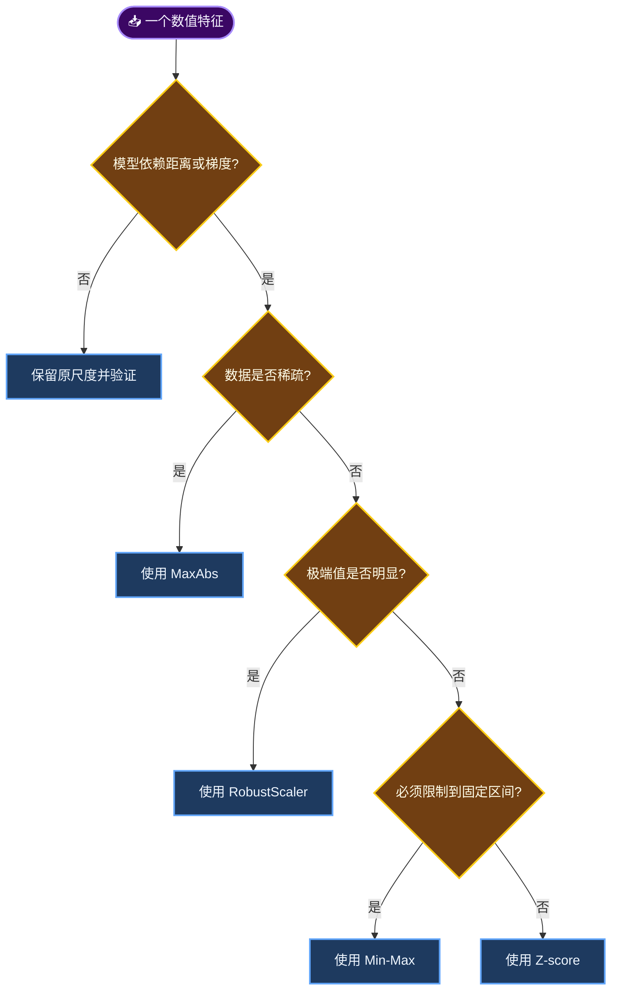

# 特征缩放与分布变换

_这组笔记整理我在建模前处理数值特征时真正会做的判断，而不是把所有方法都笼统叫作“归一化”。_

---

## 📋 先把几个名字分清

中文资料里，“归一化”经常被当作一个大筐。为了避免混淆，这里把方法分成三类：

| 类别 | 改变什么 | 典型方法 |
| --- | --- | --- |
| **缩放** | 数值中心或尺度 | Min-Max、Z-score、MaxAbs、RobustScaler |
| **分布变换** | 偏度、尾部和方差关系 | 对数、平方根、Box-Cox |
| **离散化** | 连续值保留为少数状态 | 二值化 |

缩放不会自动把数据变成正态分布；二值化也不是严格意义上的缩放。这两个误解在实际项目里很常见。

## 🔍 我会怎么选

这张图只是起点，不是替代验证集的规则。树模型通常不靠特征间的欧氏距离做决策，很多时候不缩放也能工作；KNN、K-means、SVM，以及带正则化的线性模型通常更在意特征尺度。[^1]

## 📚 逐篇阅读

### 常用缩放

- [Min-Max 缩放](min-max.md)：需要固定区间时最直观，但容易被极端值拉扯
- [Z-score 标准化](z-score.md)：默认选择之一，适合多数尺度敏感模型
- [MaxAbs 缩放](max-abs.md)：不平移零点，常用于稀疏矩阵
- [稳健缩放](robust-scaler.md)：用中位数和四分位距降低极端值的影响

### 分布变换与离散化

- [对数变换](log-transform.md)：压缩长尾，重点是先处理定义域
- [平方根变换](sqrt-transform.md)：比对数温和，常见于非负计数
- [Box-Cox 变换](box-cox.md)：由数据估计幂参数，只接受正数
- [二值化](binarization.md)：只保留是否越过阈值的信息

## ⚠️ 比选方法更重要的三件事

1. **只在训练集上拟合参数。** 均值、标准差、最小值、最大值和分位数都属于训练得到的统计量。
2. **把预处理放进流水线。** 交叉验证时让每一折单独拟合，避免数据泄漏。
3. **保留业务单位。** 模型输入可以缩放，报表、阈值和误差解释不一定要跟着换单位。

我通常先做一个简单基线，再比较“不处理、StandardScaler、RobustScaler”三组验证结果。差异不大时，优先保留更容易解释的方案。

## 🔗 参考资料

[^1]: scikit-learn developers. “Importance of Feature Scaling.” _scikit-learn Examples_. https://scikit-learn.org/stable/auto_examples/preprocessing/plot_scaling_importance.html
