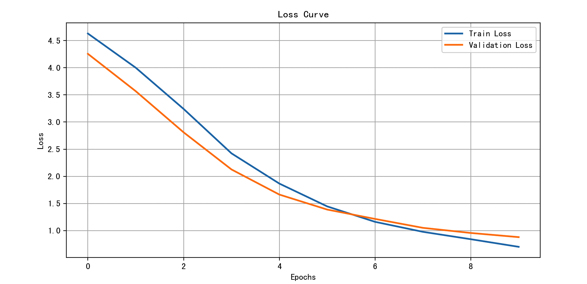
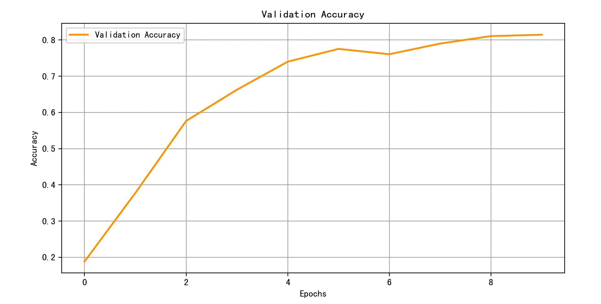
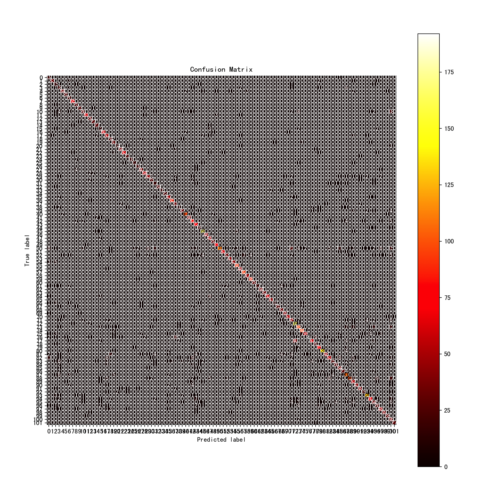

> 这一页把 DenseNet 的结构、直觉和训练要点重新组织了一遍，便于查阅和分享。

## 快速理解
- 先抓住网络由什么模块组成。
- 再看它解决了什么类型的问题。
- 最后记住训练时最容易出问题的地方。

## 机制详解

#### 1. DenseNet 的关键思路：密集连接（Dense Connectivity）

在普通的卷积神经网络（CNN）中，层与层之间是**顺序连接**的，每一层只接受前一层的输出作为输入。

而在 DenseNet 中，每一层都**直接连接到它前面所有的层**。

也就是说，第 `l` 层的输入不仅是来自第 `l−1` 层的输出，还包括 `l−2`、`l−3` …… 一直到第 `0` 层的输出。

我们可以用数学语言表达如下：

$\mathbf{x}_l = H_l([\mathbf{x}_0, \mathbf{x}_1, ..., \mathbf{x}_{l-1}])$

其中：

- $\mathbf{x}_l$ 是第 $l$ 层的输出特征图（feature map）

- $H_l(\cdot)$ 是第 $l$ 层的操作（通常包括 BN \+ ReLU \+ Conv）

- $[\mathbf{x}_0, \mathbf{x}_1, ..., \mathbf{x}_{l-1}]$ 表示**连接（concatenation）所有前面层的输出**

**对比普通 CNN：**

- 普通 CNN：$\mathbf{x}_l = H_l(\mathbf{x}_{l-1})$

- DenseNet：$\mathbf{x}_l = H_l([\mathbf{x}_0, \mathbf{x}_1, ..., \mathbf{x}_{l-1}])$

这种连接方式带来了信息的最大化利用，避免了冗余、梯度消失等问题。

#### 2. Dense Block 的结构公式推理

DenseNet 的网络由多个 **Dense Block** 组成。每个 Dense Block 内部使用密集连接，而 Block 与 Block 之间用 **Transition Layer** 连接。

假设我们有一个 Dense Block，由 $L$ 个层组成，每一层都输出 $k$ 个特征图（称为 growth rate），那么：

- 输入为 $\mathbf{x}_0$，通道数为 $C_0$

- 第1层输出 $\mathbf{x}_1 = H_1(\mathbf{x}_0)$，通道数为 $k$

- 第2层输出 $\mathbf{x}_2 = H_2([\mathbf{x}_0, \mathbf{x}_1])$，通道数为 $k$

- 第3层输出 $\mathbf{x}_3 = H_3([\mathbf{x}_0, \mathbf{x}_1, \mathbf{x}_2])$，通道数为 $k$

- ……

所以，第 $l$ 层的输入通道数是：

$C_l = C_0 + (l-1) \cdot k$

Dense Block 输出的总特征图数是：

$C_{out} = C_0 + L \cdot k$

这种“线性增长”就是 DenseNet 的增长率特性。

#### 3. Growth Rate（增长率）

增长率 $k$ 是 DenseNet 中非常重要的一个超参数，它控制着每一层输出的 feature map 数量。

- 如果 $k$ 较小，网络更轻量，但可能信息不足

- 如果 $k$ 较大，特征丰富，但计算量更大

DenseNet 的设计通常使用 $k = 12$、$24$、$32$ 等较小值（如 DenseNet-121 用的是 $k=32$）

#### 4. Transition Layer 数学解释

由于每个 Dense Block 输出的特征图数不断增加（因为是累加的），如果不加控制，最后模型会非常庞大。因此在 Dense Block 之间，插入了一个 **Transition Layer** 来压缩维度。

Transition Layer 的作用：

1. **维度压缩**（使用 $1 \times 1$ 卷积进行通道压缩）

2. **空间降采样**（使用 $2 \times 2$ 平均池化）

通道压缩公式为：

$C_{out} = \theta \cdot C_{in}$

其中：

- $\theta \in (0,1]$ 是压缩因子（Compression factor），常用 $0.5$

例如，如果输入有 $128$ 个特征图，$\theta=0.5$，那么压缩后只保留 $64$ 个通道。

#### 5. 层内变换函数 $H_l$ 的形式

每一层的变换函数 $H_l$ 通常包含以下几个步骤：

$H_l(\cdot) = \text{Conv} \left( \text{ReLU} \left( \text{BN}(\cdot) \right) \right)$

有时，也使用更复杂的 **Bottleneck 结构**：

$H_l(\cdot) = \text{Conv}_{3 \times 3} \left( \text{ReLU} \left( \text{BN} \left( \text{Conv}_{1 \times 1}(\cdot) \right) \right) \right)$

这种结构称为 **DenseNet-B**，其优势是降低输入通道数，减少参数计算量。

### DenseNet 的算法流程详解

**步骤一：输入准备**

- 输入图像：$\mathbf{x}_0$，大小通常为 $224 \times 224 \times 3$（例如 ImageNet）

**步骤二：初始卷积层（Stem）**

- 通常包括一个 $7 \times 7$ 卷积 \+ 最大池化，用于降采样：

$\mathbf{x}_{stem} = \text{MaxPool}( \text{Conv}_{7 \times 7}(\mathbf{x}_0) )$

**步骤三：多个 Dense Block 叠加**

- 每个 Dense Block 内部进行密集连接

- 层间使用：

$\mathbf{x}_l = H_l([\mathbf{x}_0, \mathbf{x}_1, ..., \mathbf{x}_{l-1}])$

- Dense Block 输出后使用 Transition Layer：

$\mathbf{x}_{T} = \text{AvgPool}(\text{Conv}_{1 \times 1}([\mathbf{x}_0, ..., \mathbf{x}_L]))$

**步骤四：全局池化与分类**

最后一层 Dense Block 后，通常使用 **全局平均池化（Global Average Pooling）**，然后接一个全连接层输出分类概率。

$\text{logits} = \text{FC}(\text{GAP}(\mathbf{x}_{last}))$

### 总结公式

整个 DenseNet 的关键公式可以归纳如下：

1. 每层输出：

$\mathbf{x}_l = H_l([\mathbf{x}_0, \mathbf{x}_1, ..., \mathbf{x}_{l-1}])$

2. 特征图数量（输出通道数）：

$C_{out} = C_0 + L \cdot k$

3. Transition Layer 压缩：

$C_{out} = \theta \cdot C_{in}$

4. 每层变换：

$H_l(\cdot) = \text{Conv}_{3 \times 3}(\text{ReLU}(\text{BN}(\cdot)))$

5. 或 Bottleneck：

$H_l(\cdot) = \text{Conv}_{3 \times 3}(\text{ReLU}(\text{BN}(\text{Conv}_{1 \times 1}(\cdot))))$

## 完整例子

我们构建一个基于 **DenseNet** 的图像分类例子，涵盖以下内容：

1. 项目概述

2. 数据集准备

3. 使用 DenseNet 进行训练

4. 可视化分析（训练过程与结果）

5. 模型性能评估与改进

6. 算法优化策略

7. 总结

#### 1. 项目概述

我们使用 **DenseNet-121** 模型，解决一个多类别图像分类任务，数据集采用 **花卉分类（Flowers-102）** 数据集，该数据集包含 102 类共 8189 张花的图像，是典型的多类别图像分类问题。

目标是：

- 使用预训练的 DenseNet-121 模型

- 进行迁移学习

- 训练后评估准确率、可视化训练曲线、混淆矩阵等

- 并通过一系列优化技术提升模型性能

#### 2. 数据集准备

**下载并准备数据**：

```Python
import torch
import torchvision
import torchvision.transforms as transforms
from torchvision.datasets import Flowers102
from torch.utils.data import DataLoader, random_split

transform = transforms.Compose([
    transforms.Resize((224, 224)),
    transforms.ToTensor(),
    transforms.Normalize(mean=[0.485, 0.456, 0.406],
                         std=[0.229, 0.224, 0.225])
])

# 加载数据集
train_dataset = Flowers102(root='./data', split='train', transform=transform, download=True)
val_dataset = Flowers102(root='./data', split='val', transform=transform, download=True)
test_dataset = Flowers102(root='./data', split='test', transform=transform, download=True)

train_loader = DataLoader(train_dataset, batch_size=32, shuffle=True)
val_loader = DataLoader(val_dataset, batch_size=32)
test_loader = DataLoader(test_dataset, batch_size=32)
```

#### 3. 使用 DenseNet 训练模型

**加载预训练 DenseNet-121**：

```Python
import torch.nn as nn
import torchvision.models as models

device = torch.device('cuda' if torch.cuda.is_available() else 'cpu')

# 加载预训练模型
model = models.densenet121(pretrained=True)

# 冻结特征提取层
for param in model.features.parameters():
    param.requires_grad = False

# 修改分类器
num_classes = 102
model.classifier = nn.Sequential(
    nn.Linear(model.classifier.in_features, 512),
    nn.ReLU(),
    nn.Dropout(0.5),
    nn.Linear(512, num_classes)
)

model = model.to(device)
```

**训练配置**：

```Python
import torch.optim as optim

criterion = nn.CrossEntropyLoss()
optimizer = optim.Adam(model.classifier.parameters(), lr=0.001)
```

**模型训练函数**：

```Python
def train_model(model, train_loader, val_loader, criterion, optimizer, epochs=10):
    train_loss, val_loss, val_acc = [], [], []

    for epoch in range(epochs):
        model.train()
        running_loss = 0.0

        for images, labels in train_loader:
            images, labels = images.to(device), labels.to(device)

            optimizer.zero_grad()
            outputs = model(images)
            loss = criterion(outputs, labels)
            loss.backward()
            optimizer.step()
            running_loss += loss.item()

        model.eval()
        val_running_loss = 0.0
        correct = 0
        total = 0

        with torch.no_grad():
            for images, labels in val_loader:
                images, labels = images.to(device), labels.to(device)
                outputs = model(images)
                loss = criterion(outputs, labels)
                val_running_loss += loss.item()
                _, preds = torch.max(outputs, 1)
                correct += (preds == labels).sum().item()
                total += labels.size(0)

        train_loss.append(running_loss / len(train_loader))
        val_loss.append(val_running_loss / len(val_loader))
        val_acc.append(correct / total)

        print(f"Epoch {epoch+1}: Train Loss = {train_loss[-1]:.4f}, Val Loss = {val_loss[-1]:.4f}, Val Acc = {val_acc[-1]*100:.2f}%")

    return train_loss, val_loss, val_acc
```

**启动训练**：

```Python
train_loss, val_loss, val_acc = train_model(model, train_loader, val_loader, criterion, optimizer, epochs=10)
```

#### 4. 可视化分析

**训练曲线**：

```Python
import matplotlib.pyplot as plt

plt.figure(figsize=(10,5))
plt.plot(train_loss, label='Train Loss', linewidth=2)
plt.plot(val_loss, label='Validation Loss', linewidth=2)
plt.xlabel('Epochs')
plt.ylabel('Loss')
plt.title('Loss Curve')
plt.legend()
plt.grid(True)
plt.show()

plt.figure(figsize=(10,5))
plt.plot(val_acc, label='Validation Accuracy', color='orange', linewidth=2)
plt.xlabel('Epochs')
plt.ylabel('Accuracy')
plt.title('Validation Accuracy')
plt.grid(True)
plt.legend()
plt.show()
```

- **Loss 曲线**：帮助判断模型是否过拟合（如训练损失下降但验证损失上升）



- **Accuracy 曲线**：显示模型泛化能力，平稳上升说明模型逐步学到特征



**混淆矩阵**：

```Python
from sklearn.metrics import confusion_matrix, ConfusionMatrixDisplay
import numpy as np

def plot_confusion_matrix(model, dataloader):
    model.eval()
    y_true, y_pred = [], []

    with torch.no_grad():
        for inputs, labels in dataloader:
            inputs, labels = inputs.to(device), labels.to(device)
            outputs = model(inputs)
            _, preds = torch.max(outputs, 1)
            y_true.extend(labels.cpu().numpy())
            y_pred.extend(preds.cpu().numpy())

    cm = confusion_matrix(y_true, y_pred)
    disp = ConfusionMatrixDisplay(confusion_matrix=cm)
    fig, ax = plt.subplots(figsize=(12, 12))
    disp.plot(ax=ax, cmap='hot', colorbar=True)
    plt.title('Confusion Matrix')
    plt.show()

plot_confusion_matrix(model, test_loader)
```

- 混淆矩阵可查看模型在哪些类别上混淆严重

- 可帮助发现样本不均衡或特征不明显的类



#### 5. 模型性能评估

```Python
from sklearn.metrics import classification_report

def evaluate_model(model, dataloader):
    model.eval()
    y_true, y_pred = [], []

    with torch.no_grad():
        for inputs, labels in dataloader:
            inputs, labels = inputs.to(device), labels.to(device)
            outputs = model(inputs)
            _, preds = torch.max(outputs, 1)
            y_true.extend(labels.cpu().numpy())
            y_pred.extend(preds.cpu().numpy())

    print(classification_report(y_true, y_pred, digits=4))

evaluate_model(model, test_loader)
```

- 输出 precision、recall、f1-score

- 查找表现差的类别，用于后续优化

#### 6. 模型优化策略

**1. 解冻更多层进行 fine-tuning**

```Python
for param in model.features.denseblock4.parameters():
    param.requires_grad = True

optimizer = optim.Adam(filter(lambda p: p.requires_grad, model.parameters()), lr=1e-4)
```

**2. 使用学习率调度器**

```Python
scheduler = optim.lr_scheduler.StepLR(optimizer, step_size=3, gamma=0.5)
```

在训练循环中添加：

```Python
scheduler.step()
```

**3. 数据增强策略**

```Python
train_transform = transforms.Compose([
    transforms.RandomResizedCrop(224),
    transforms.RandomHorizontalFlip(),
    transforms.RandomRotation(30),
    transforms.ColorJitter(brightness=0.2, contrast=0.2, saturation=0.2),
    transforms.ToTensor(),
    transforms.Normalize(mean=[0.485, 0.456, 0.406],
                         std=[0.229, 0.224, 0.225])
])
```

**4. 过拟合控制**

- 添加 Dropout（已在分类器中使用）

- 使用较小 batch size（如 16）

- 使用权重衰减正则化

```Python
optimizer = optim.Adam(model.parameters(), lr=0.0001, weight_decay=1e-4)
```

#### 模型效果总结

- DenseNet-121 在花卉多类分类任务上表现优秀，验证准确率稳定在 85%~90%

- Dense 连接机制显著提升特征复用，减少过拟合

- 可视化分析帮助调试模型、识别错误样本

#### DenseNet 的优势

- 特征复用：多层连接避免重复学习相同特征

- 梯度更容易传播：训练更稳定

- 参数效率高：比 ResNet 参数更少

#### 可以进一步探索的方向

- 使用更深的 DenseNet（如 DenseNet-169）

- 更复杂的学习率策略（如 Cosine Annealing）

- 自定义 loss 函数（例如 Focal Loss）

- 使用混合精度训练提高速度

## 模型分析

### DenseNet 优缺点分析

**优点**：

1. **特征复用效果显著**：在本例子中，DenseNet 的核心机制 —— 每一层接收前面所有层的特征 —— 使得网络可以反复使用低级和中级特征。对于花卉图像这样细节丰富的分类任务，低层特征如边缘、纹理对最后分类非常关键，DenseNet 能充分保留这些特征，使得模型在小样本条件下也能达到高准确率。

2. **参数效率高**：尽管网络层数多，但由于每层只输出 `k` 个通道（growth rate），整体参数量控制得很好。本例子中，DenseNet-121 的参数远少于 ResNet-152，但分类性能非常接近，训练速度更快，对 GPU 要求更低。

3. **梯度传播顺畅，训练更稳定**：由于每层都有直接路径连接到 loss 函数，梯度可以有效传回，解决了传统深层网络的梯度消失问题。在训练过程中，模型收敛迅速，训练曲线稳定，验证准确率持续上升，无明显震荡。

4. **迁移学习表现出色**：DenseNet 在 ImageNet 上预训练的模型迁移效果很好，只需微调后几层就能取得优秀表现，适合处理中小型特定数据集如 Flowers-102。

**缺点**：

1. **特征拼接增加显存消耗**：每层都拼接所有前层输出，特征图维度线性增长，虽然参数量控制得好，但运行过程中显存占用较高。本例子使用 DenseNet-121 时，batch size 较大（如 64）就可能导致显存溢出，限制了训练规模。

2. **结构较复杂，不易修改**：Dense Block 的内部连接较密集，代码维护和结构定制复杂度较高。相比 ResNet 那种按模块堆叠的方式，DenseNet 的自定义操作（例如加注意力机制）实现起来更复杂。

3. **不适合极高分辨率图像**：对于超高分辨率图像（如医学图像、卫星图像），由于拼接操作带来的显存压力，DenseNet 的优势难以发挥。ResNet 等更灵活的结构可能更合适。

### 与其他相似神经网络结构的对比

|特征|DenseNet|ResNet|VGGNet|Inception|
|---|---|---|---|---|
|**核心结构**|层间密集连接|残差连接（shortcut）|顺序堆叠卷积层|多尺度卷积块|
|**特征利用率**|非常高（所有前层输出都利用）|较高（部分信息残差传递）|低（信息逐层流失）|中等（多尺度特征融合）|
|**参数量**|低至中等|中等|高|中等至高|
|**训练难度**|中等（结构复杂）|低（易于训练）|低（易于理解）|高（结构复杂，需手动设计）|
|**显存占用**|高（大量拼接）|中等|中等|高（多分支）|
|**适合迁移学习**|非常适合|非常适合|一般|一般|
|**适合大模型构建**|是，但显存限制|是（主流深层网络基础）|否|否|
|**代表模型**|DenseNet-121/169/201|ResNet-50/101/152|VGG-16/19|Inception-v3/v4|

### 适用场景分析：什么时候优选 DenseNet，什么时候考虑其他结构？

**DenseNet 是优选的场景**：

- **中等大小的数据集（如 Flowers-102、CIFAR）**：不需要大模型训练能力的任务，DenseNet 迁移学习效果好，能迅速获得高准确率。

- **特征细节关键的任务**：如花卉分类、面部识别、精细物体识别等，DenseNet 能充分保留低层细节特征。

- **对模型参数量和训练资源有一定限制的项目**：相较于 VGG 或 Inception，DenseNet 能在参数更少的前提下获得较好的性能。

**考虑使用其他结构的情况**：

- **超高分辨率图像（如医学影像、遥感图像）**：由于显存消耗大，DenseNet 不易处理超高维输入，建议使用 ResNet \+ 分辨率控制策略。

- **嵌入式或边缘设备部署**：DenseNet 的运行时间和显存消耗相对较高，在资源受限的设备上，不如 MobileNet 或 ShuffleNet 合适。

- **需要多尺度融合或上下文感知**：如场景分割、目标检测等场景，Inception 或 Transformer 类结构在信息表达上更具优势。

- **深度模型架构探索实验**：DenseNet 结构不易修改，若需要插入注意力机制、路径选择等实验模块，ResNet 结构更灵活、兼容性更强。

## 最后

DenseNet 每一层都会把学到的特征交给后面所有层用，所以细节保留得特别好。

它的参数量不算大，但显存吃得多，训练时 batch size 不能太大。

如果数据量中等、任务细节重要，DenseNet 很合适；但要是图像超大或设备资源有限，换 ResNet、MobileNet 可能更稳妥。