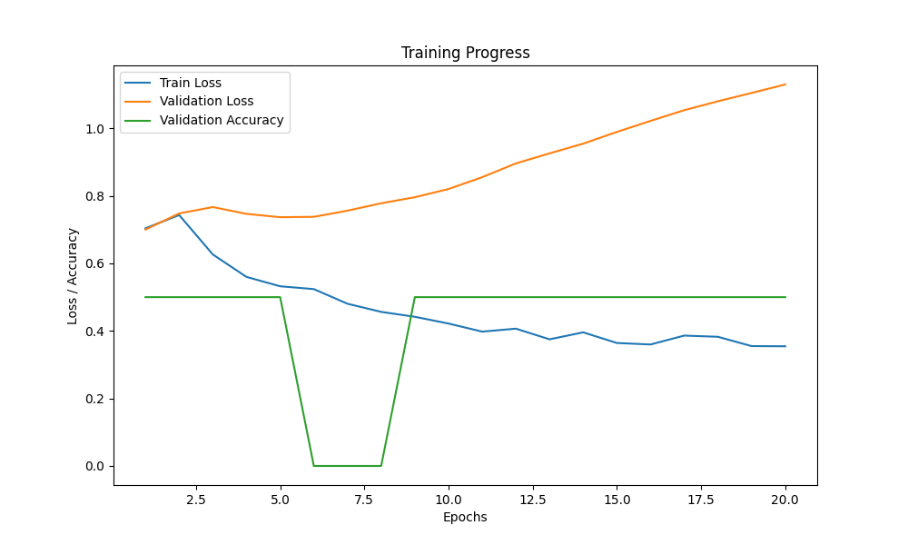

> 这一页把 GRU (门控循环单元) 的结构、直觉和训练要点重新组织了一遍，便于查阅和分享。

## 快速理解
- 先抓住网络由什么模块组成。
- 再看它解决了什么类型的问题。
- 最后记住训练时最容易出问题的地方。

## 理论基础

### 1. GRU 的基本结构

GRU 是一种循环神经网络，主要用于解决普通 RNN 的梯度消失问题。它通过引入门机制（更新门和重置门）控制信息的流动，从而更好地捕获长期依赖关系。

GRU 的每个时间步由以下几部分组成：

1. **更新门 (**$z_t$**)**：控制当前时间步的信息是否需要更新。

2. **重置门 (**$r_t$**)**：控制前一时间步的信息是否需要遗忘。

3. **候选隐藏状态 (**$\tilde{h}_t$**)**：生成新的记忆内容。

4. **隐藏状态 (**$h_t$**)**：通过更新门决定是保留旧信息还是采用新信息。

### 2. 数学公式与推导

#### 输入和输出表示

- 输入：当前时间步的输入向量 $x_t \in \mathbb{R}^n$。

- 隐藏状态：上一个时间步的隐藏状态 $h_{t-1} \in \mathbb{R}^m$，当前时间步的隐藏状态 $h_t \in \mathbb{R}^m$。

- 权重矩阵：

    - 输入到门的权重：$W_z, W_r, W_h \in \mathbb{R}^{m \times n}$。

    - 隐藏状态到门的权重：$U_z, U_r, U_h \in \mathbb{R}^{m \times m}$。

- 偏置项：$b_z, b_r, b_h \in \mathbb{R}^m$。

#### 更新门 ($z_t$)

更新门决定隐藏状态 $h_t$ 中的旧信息 $h_{t-1}$ 应该保留多少，以及新信息 $\tilde{h}_t$ 应该引入多少。

公式为：

$z_t = \sigma(W_z x_t + U_z h_{t-1} + b_z)$

- $W_z x_t$：输入对更新门的影响。

- $U_z h_{t-1}$：上一时间步的隐藏状态对更新门的影响。

- $\sigma$：Sigmoid 激活函数，输出范围在 $[0, 1]$。

#### 重置门 ($r_t$)

重置门控制如何利用上一个时间步的隐藏状态 $h_{t-1}$，决定哪些过去的信息需要被“遗忘”。

公式为：

$r_t = \sigma(W_r x_t + U_r h_{t-1} + b_r)$

- $W_r x_t$：输入对重置门的影响。

- $U_r h_{t-1}$：上一时间步的隐藏状态对重置门的影响。

- $\sigma$：Sigmoid 激活函数，输出范围在 $[0, 1]$。

#### 候选隐藏状态 ($\tilde{h}_t$)

候选隐藏状态是根据当前输入 $x_t$ 和重置后的隐藏状态生成的，是 GRU 中的“新信息”。

公式为：

$\tilde{h}_t = \tanh(W_h x_t + U_h (r_t \odot h_{t-1}) + b_h)$

- $r_t \odot h_{t-1}$：重置门 $r_t$ 选择了上一隐藏状态 $h_{t-1}$ 中的重要信息，$\odot$ 表示逐元素相乘。

- $\tanh$：双曲正切函数，将结果压缩到 $[-1, 1]$。

#### 最后隐藏状态 ($h_t$)

最后隐藏状态是旧隐藏状态 $h_{t-1}$ 和候选隐藏状态 $\tilde{h}_t$ 的加权平均，由更新门 $z_t$ 决定权重：

$h_t = z_t \odot h_{t-1} + (1 - z_t) \odot \tilde{h}_t$

- $z_t \odot h_{t-1}$：更新门 $z_t$ 决定保留多少旧信息。

- $(1 - z_t) \odot \tilde{h}_t$：更新门决定引入多少新信息。

### 3. GRU 的计算流程

1. **输入数据准备**：

    - 当前时间步的输入向量 $x_t$。

    - 上一时间步的隐藏状态 $h_{t-1}$。

2. **计算门值**：

    - 计算更新门 $z_t = \sigma(W_z x_t + U_z h_{t-1} + b_z)$。

    - 计算重置门 $r_t = \sigma(W_r x_t + U_r h_{t-1} + b_r)$。

3. **生成候选隐藏状态**：

    - 使用重置门筛选旧隐藏状态信息 $r_t \odot h_{t-1}$。

    - 计算候选隐藏状态 $\tilde{h}_t = \tanh(W_h x_t + U_h (r_t \odot h_{t-1}) + b_h)$。

4. **更新隐藏状态**：

    - 根据更新门的权重，计算最后隐藏状态 $h_t = z_t \odot h_{t-1} + (1 - z_t) \odot \tilde{h}_t$。

5. **输出隐藏状态**：

    - 输出 $h_t$，同时作为下一时间步的输入。

### 4. 总结几点

GRU 的特点是通过更新门和重置门动态控制信息流：

- **更新门 (**$z_t$**)** 决定新旧信息的融合比例。

- **重置门 (**$r_t$**)** 决定是否保留过去的信息。

- **候选隐藏状态 (**$\tilde{h}_t$**)** 是新信息的候选。

最后隐藏状态 $h_t$ 是新旧信息的加权平均，使得 GRU 能高效地捕获序列数据中的短期和长期依赖关系。

## 完整例子

以下是一个完整的 GRU 应用例子，使用 PyTorch 实现自然语言处理任务：**文本情感分类**。

模型接收文本序列（如影评），预测其情感类别（正面或负面）。

包括：

1. 数据准备与处理

2. GRU 模型定义

3. 模型训练与验证

4. 可视化分析

5. 模型优化

```Python
import torch
import torch.nn as nn
import torch.optim as optim
from torch.utils.data import DataLoader, Dataset
from sklearn.model_selection import train_test_split
from sklearn.metrics import accuracy_score
import matplotlib.pyplot as plt
from collections import Counter
import numpy as np
import re

torch.manual_seed(42)

# 1. 数据准备
# 示例影评数据（可以替换为实际数据集）
data = [
    ("The movie was fantastic! I loved it.", 1),
    ("Horrible movie. Waste of time.", 0),
    ("Quite boring and dull.", 0),
    ("It was a masterpiece. Truly amazing!", 1),
    ("I wouldn't recommend it to anyone.", 0),
    ("Absolutely wonderful! Great acting.", 1),
]

# 数据清洗与分词
def clean_text(text):
    text = re.sub(r"[^a-zA-Z0-9\s]", "", text)  # 移除特殊字符
    return text.lower().split()

# 构建词汇表
tokenized_data = [clean_text(sentence) for sentence, _ in data]
all_words = [word for sentence in tokenized_data for word in sentence]
word_counts = Counter(all_words)
vocab = {word: i+1 for i, word in enumerate(word_counts.keys())}  # 单词映射为索引
vocab_size = len(vocab) + 1  # 加入0表示的填充

# 将文本序列转换为索引序列
def encode_sentence(sentence, vocab, max_length=10):
    encoded = [vocab.get(word, 0) for word in sentence]  # 未知词为0
    return encoded[:max_length] + [0] * (max_length - len(encoded))

max_length = 10  # 句子长度固定为10
X = [encode_sentence(sentence, vocab, max_length) for sentence, _ in data]
y = [label for _, label in data]

# 数据集划分
X_train, X_val, y_train, y_val = train_test_split(X, y, test_size=0.2, random_state=42)

# 自定义数据集类
class SentimentDataset(Dataset):
    def __init__(self, X, y):
        self.X = torch.tensor(X, dtype=torch.long)
        self.y = torch.tensor(y, dtype=torch.float32)

    def __len__(self):
        return len(self.X)

    def __getitem__(self, idx):
        return self.X[idx], self.y[idx]

train_dataset = SentimentDataset(X_train, y_train)
val_dataset = SentimentDataset(X_val, y_val)

train_loader = DataLoader(train_dataset, batch_size=2, shuffle=True)
val_loader = DataLoader(val_dataset, batch_size=2, shuffle=False)

# 2. GRU 模型定义
class GRUModel(nn.Module):
    def __init__(self, vocab_size, embedding_dim, hidden_dim, output_dim):
        super(GRUModel, self).__init__()
        self.embedding = nn.Embedding(vocab_size, embedding_dim)
        self.gru = nn.GRU(embedding_dim, hidden_dim, batch_first=True)
        self.fc = nn.Linear(hidden_dim, output_dim)
        self.sigmoid = nn.Sigmoid()

    def forward(self, x):
        embedded = self.embedding(x)  # (batch_size, seq_len, embedding_dim)
        _, hidden = self.gru(embedded)  # hidden: (1, batch_size, hidden_dim)
        output = self.fc(hidden.squeeze(0))  # 去掉第1维 (batch_size, hidden_dim)
        return self.sigmoid(output)

# 模型参数
embedding_dim = 16
hidden_dim = 32
output_dim = 1
model = GRUModel(vocab_size, embedding_dim, hidden_dim, output_dim)

# 3. 模型训练
criterion = nn.BCELoss()  # 二分类交叉熵
optimizer = optim.Adam(model.parameters(), lr=0.01)

def train_model(model, train_loader, val_loader, epochs=10):
    train_losses, val_losses, val_accuracies = [], [], []

    for epoch in range(epochs):
        model.train()
        train_loss = 0.0
        for X_batch, y_batch in train_loader:
            optimizer.zero_grad()
            predictions = model(X_batch).squeeze(1)
            loss = criterion(predictions, y_batch)
            loss.backward()
            optimizer.step()
            train_loss += loss.item()

        train_losses.append(train_loss / len(train_loader))

        # 验证模型
        model.eval()
        val_loss, all_preds, all_labels = 0.0, [], []
        with torch.no_grad():
            for X_batch, y_batch in val_loader:
                predictions = model(X_batch).squeeze(1)
                loss = criterion(predictions, y_batch)
                val_loss += loss.item()
                all_preds += (predictions > 0.5).int().tolist()
                all_labels += y_batch.int().tolist()

        val_losses.append(val_loss / len(val_loader))
        val_accuracies.append(accuracy_score(all_labels, all_preds))

        print(f"Epoch {epoch+1}/{epochs} | Train Loss: {train_losses[-1]:.4f} | "
              f"Val Loss: {val_losses[-1]:.4f} | Val Acc: {val_accuracies[-1]:.4f}")

    return train_losses, val_losses, val_accuracies

# 训练模型
epochs = 20
train_losses, val_losses, val_accuracies = train_model(model, train_loader, val_loader, epochs)

# 4. 可视化分析
plt.figure(figsize=(10, 6))
plt.plot(range(1, epochs+1), train_losses, label="Train Loss")
plt.plot(range(1, epochs+1), val_losses, label="Validation Loss")
plt.plot(range(1, epochs+1), val_accuracies, label="Validation Accuracy")
plt.xlabel("Epochs")
plt.ylabel("Loss / Accuracy")
plt.legend()
plt.title("Training Progress")
plt.show()

# 5. 模型优化
# - 调整超参数：如 embedding_dim, hidden_dim, 学习率
# - 数据增强：引入更多样本，扩展训练数据
# - 提升 GRU 表现：引入 Dropout 层以减少过拟合
# - 模型结构改进：堆叠多层 GRU、使用双向 GRU

# 示例：添加 Dropout 优化模型
class OptimizedGRUModel(nn.Module):
    def __init__(self, vocab_size, embedding_dim, hidden_dim, output_dim):
        super(OptimizedGRUModel, self).__init__()
        self.embedding = nn.Embedding(vocab_size, embedding_dim)
        self.gru = nn.GRU(embedding_dim, hidden_dim, batch_first=True, dropout=0.2)
        self.fc = nn.Linear(hidden_dim, output_dim)
        self.sigmoid = nn.Sigmoid()

    def forward(self, x):
        embedded = self.embedding(x)
        _, hidden = self.gru(embedded)
        output = self.fc(hidden.squeeze(0))
        return self.sigmoid(output)

# 可替换模型后重新训练以优化效果
```



1. **训练曲线分析**：

    - 如果验证损失停止下降或开始上升，表明模型过拟合。

    - 增加 Dropout 或早停（Early Stopping）可以改善。

2. **优化策略**：

    - 增大模型复杂度（堆叠 GRU 层、双向 GRU）。

    - 调整学习率和批量大小。

    - 增加数据规模或清洗数据质量。

此示例展示了 GRU 在文本分类中的应用及优化思路，同时结合可视化帮助分析模型表现。

## 模型分析

### 优点

1. **计算效率高**：GRU 的结构比 LSTM（长短期记忆网络）更简单，参数更少，计算开销更低，适合在资源有限或需要快速训练的场景中使用。

2. **解决长依赖问题**：引入了更新门和重置门，有效缓解了普通 RNN 遇到的梯度消失问题，可以捕获长期上下文依赖关系。

3. **灵活性强**：GRU 的门机制可以自动控制信息的保留与遗忘，适用于序列数据（如时间序列、文本数据等）的多种任务，包括分类、生成和预测。

4. **占用内存较小**：GRU 的参数比 LSTM 少，因此在模型规模较大时，GRU 通常需要更少的内存资源。

### 缺点

1. **表达能力可能不及 LSTM**：虽然 GRU 的结构较为简单，但在某些复杂的序列任务中（如需要精确记忆多个长期依赖关系时），LSTM 的表现可能优于 GRU。

2. **不适用于所有类型的序列**：对于某些高度非线性的时间序列或需要更复杂信息流管理的任务，GRU 的简单结构可能限制其性能。

3. **较难处理非序列数据**：GRU 天生设计是为序列任务服务的，对于非序列任务（如图像处理或随机数据关系建模），并不是最佳选择。

### 与相似算法的对比

#### 1. GRU vs LSTM

|**特性**|**GRU**|**LSTM**|
|---|---|---|
|**结构复杂性**|简单，只有两个门（更新门和重置门）。|复杂，包含三个门（输入门、遗忘门、输出门）。|
|**参数数量**|较少，因此训练速度更快，占用内存更小。|较多，因此更能捕获复杂依赖关系，但更耗资源。|
|**性能**|适合大多数任务，尤其是数据量小或计算资源有限时。|在长序列或需要精确建模长期依赖的任务中表现更好。|
|**应用场景**|快速实验、小型模型、资源受限环境。|更复杂的任务，如语音识别或长序列依赖建模。|

#### 2. GRU vs Transformer

|**特性**|**GRU**|**Transformer**|
|---|---|---|
|**并行化能力**|时间步是顺序依赖的，难以并行化计算。|利用注意力机制，可以大规模并行化，计算效率更高。|
|**适用场景**|适合较短的序列或需要在线预测的任务（如实时数据）。|更适合长序列任务（如机器翻译、文档摘要）。|
|**表达能力**|依赖门机制，捕获局部和全局依赖关系有限。|使用自注意力机制，可以捕获序列全局的上下文关系。|

### 在什么情况下选择 GRU？

#### GRU 是优选的情况

1. **计算资源有限**：在边缘设备或需要快速迭代开发的场景中，GRU 的效率是一个显著的优势。

2. **数据量较小**：GRU 参数较少，相比 LSTM 更适合在小数据集上训练，避免过拟合。

3. **任务中依赖中短期记忆**：如果任务的依赖关系主要集中在较短时间范围内（例如短文本分类、股价短期波动预测），GRU 足以胜任。

4. **实时性要求高**：GRU 的简单结构使其适合实时任务，如在线数据流处理。

#### 考虑其他算法的情况

1. **长序列依赖**：如果序列依赖很长（如长文档翻译），LSTM 或 Transformer 可能表现更好。

2. **需要全局上下文建模**：Transformer 等基于自注意力的模型更擅长建模序列中远距离的依赖关系，尤其是在自然语言处理任务中（如文本生成、文档分类）。

3. **大规模并行计算**：GRU 和 RNN 都是顺序处理的，无法利用并行计算硬件的优势。对于需要处理大量数据或长序列任务，Transformer 是更好的选择。