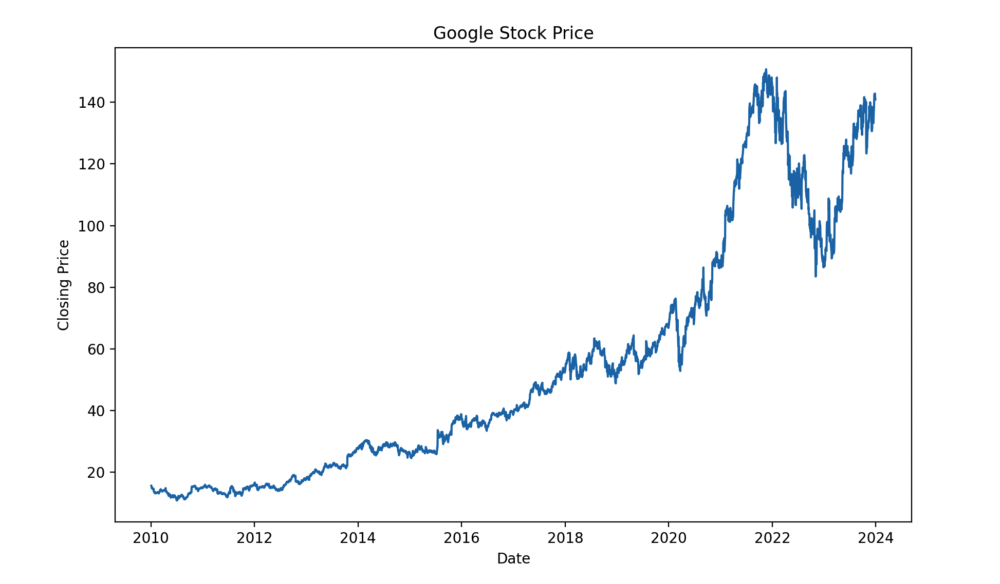
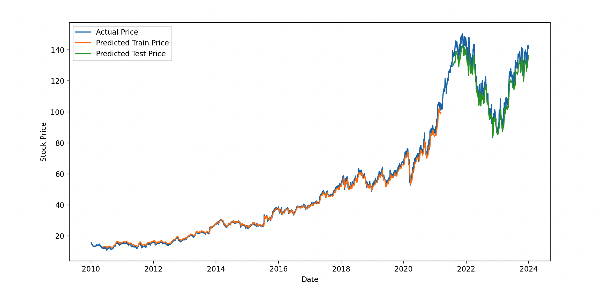
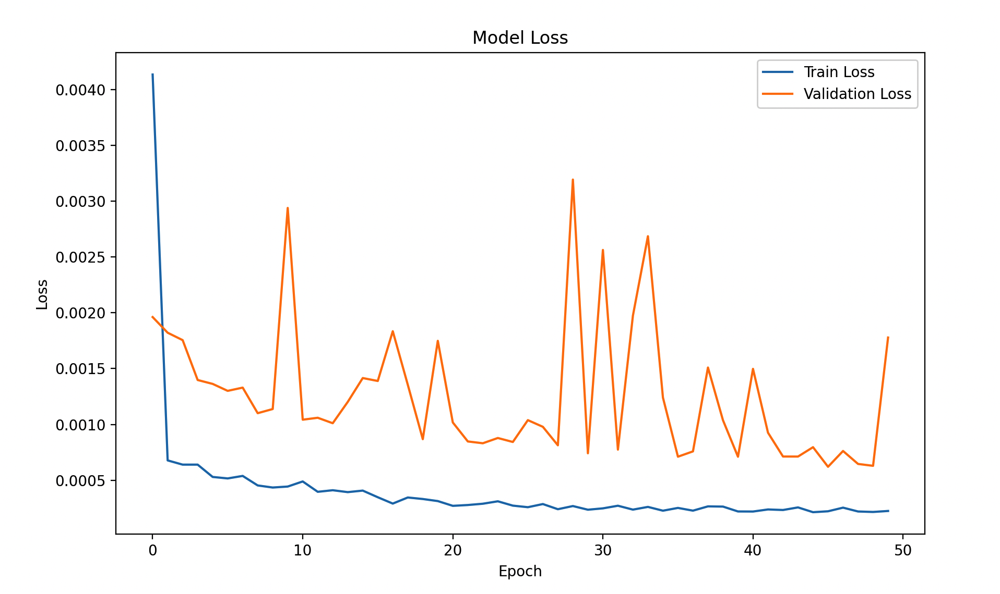

> 这一页把 LSTM 的结构、直觉和训练要点重新组织了一遍，便于查阅和分享。

## 快速理解
- 先抓住网络由什么模块组成。
- 再看它解决了什么类型的问题。
- 最后记住训练时最容易出问题的地方。

## 理论基础

LSTM 专门设计用于处理和预测时间序列数据。它克服了标准RNN的长期依赖问题，可以更好地捕捉长距离的时间依赖性。

### LSTM的数学机制

你提供的LSTM的公式和解释总体上是正确的，但是有一些细节可以进一步澄清和细化。以下是一些调整和补充，以确保每一步都准确无误。

### 1. 遗忘门（Forget Gate）

遗忘门控制着当前单元状态中哪些信息需要被丢弃。遗忘门的输出是一个0到1之间的值，表示每个信息保留的程度。

$f_t = \sigma(W_f \cdot [h_{t-1}, x_t] + b_f)$

- $f_t $是遗忘门的输出。

- $\sigma $是sigmoid激活函数。

- $W_f $是遗忘门的权重矩阵。

- $[h_{t-1}, x_t]$ 是上一个时刻的隐藏状态和当前输入的连接。

- $b_f $是遗忘门的偏置项。

### 2. 输入门（Input Gate）

输入门控制着新信息的加入程度。它包括两个部分：一个sigmoid层决定需要更新的信息，另一个tanh层生成新的候选记忆单元。

公式：

$i_t = \sigma(W_i \cdot [h_{t-1}, x_t] + b_i)$

$\tilde{C}_t = \tanh(W_C \cdot [h_{t-1}, x_t] + b_C)$

- $i_t $是输入门的输出。

- $\tilde{C}_t $是新的候选记忆单元。

- $W_i $和 $W_C $是输入门和候选记忆单元的权重矩阵。

- $b_i $和 $b_C $是输入门和候选记忆单元的偏置项。

### 3. 更新记忆单元状态

通过遗忘门和输入门的作用，更新当前的记忆单元状态。

公式：

$C_t = f_t \cdot C_{t-1} + i_t \cdot \tilde{C}_t$

- $C_t $是当前时刻的记忆单元状态。

- $C_{t-1} $是上一个时刻的记忆单元状态。

### 4. 输出门（Output Gate）

输出门控制着当前时刻的隐藏状态输出。它决定哪些部分的记忆单元状态将被输出。

公式：

$o_t = \sigma(W_o \cdot [h_{t-1}, x_t] + b_o)$

$h_t = o_t \cdot \tanh(C_t)$

- $o_t $是输出门的输出。

- $h_t $是当前时刻的隐藏状态。

- $W_o $是输出门的权重矩阵。

- $b_o $是输出门的偏置项。

### LSTM的算法流程

下面是LSTM在处理时间序列数据时的详细算法流程：

**1. 初始化**：初始化LSTM的权重矩阵和偏置项。

**2. 输入数据**：输入时间序列数据 $x_t $。

**3. 计算遗忘门输出** $f_t $：

$f_t = \sigma(W_f \cdot [h_{t-1}, x_t] + b_f)$

**4. 计算输入门输出** $i_t $：

$i_t = \sigma(W_i \cdot [h_{t-1}, x_t] + b_i)$

**5. 生成候选记忆单元** $\tilde{C}_t $：

$\tilde{C}_t = \tanh(W_C \cdot [h_{t-1}, x_t] + b_C)$

**6. 更新记忆单元状态** $C_t $：

$C_t = f_t \cdot C_{t-1} + i_t \cdot \tilde{C}_t$

**7. 计算输出门输出** $o_t $：

$o_t = \sigma(W_o \cdot [h_{t-1}, x_t] + b_o)$

**8. 计算当前隐藏状态** $h_t $：

$h_t = o_t \cdot \tanh(C_t)$

**9. 输出隐藏状态** $h_t $并更新内部状态 $C_t $。

LSTM通过遗忘门、输入门、候选记忆单元和输出门来控制信息的流动和更新，克服了传统RNN中梯度消失和梯度爆炸的问题，使其可以更好地捕捉长时间依赖关系。其关键思路是通过门控机制选择性地保留和更新信息，从而实现对时间序列数据的有效建模和预测。

### 应用场景

LSTM适用于许多与序列数据相关的问题，特别是在需要捕捉长期依赖关系的情况下。以下是LSTM适用的问题类型、优缺点以及运用时的前提条件，以及一个实际中的应用例子。

**适用问题类型**

1. **自然语言处理（NLP）**：包括语言建模、文本分类、命名实体识别等任务。

2. **时间序列预测**：如股票价格预测、天气预测、交通流量预测等。

3. **音频处理**：包括语音识别、语音合成等。

4. **视频分析**：如行为识别、视频描述生成等。

**运用时的前提条件**

1. **大量的序列数据**：LSTM在大数据集上表现更好，需要足够的数据来进行训练。

2. **适当的特征工程**：在应用LSTM之前，需要进行适当的特征工程，以准备输入数据。

3. **合适的超参数调优**：LSTM具有许多超参数，需要进行合适的调优以获得最佳性能。

## Python例子

聊了这么多的基础之后，我们下面举例一个完整的LSTM（长短期记忆网络）示例，它包括数据准备、LSTM模型构建、训练、评估和可视化。

使用Keras和TensorFlow库来实现一个时间序列预测的例子，例如预测股票价格。

### 数据准备

首先，我们需要一个时间序列数据集。这次我们使用的是股票市场数据（例如Google的股票价格）。

数据集获取：公众号「深夜努力写Python」后台，回复『数据集』即可拿到~

```Python
import pandas as pd
import numpy as np
import matplotlib.pyplot as plt

# 加载数据集（公众号后台回复“数据集”即可）
data = pd.read_csv('GOOG.csv')
data['Date'] = pd.to_datetime(data['Date'])
data.set_index('Date', inplace=True)

# 绘制收盘价
plt.figure(figsize=(10, 6))
plt.plot(data['Close'])
plt.title('Google Stock Price')
plt.xlabel('Date')
plt.ylabel('Closing Price')
plt.show()
```



### 数据预处理

为了训练LSTM模型，我们需要对数据进行标准化，并将其转化为合适的输入格式。

```Python
from sklearn.preprocessing import MinMaxScaler

scaler = MinMaxScaler(feature_range=(0, 1))
scaled_data = scaler.fit_transform(data['Close'].values.reshape(-1, 1))

# 创建训练和测试数据集
train_size = int(len(scaled_data) * 0.8)
train_data = scaled_data[:train_size]
test_data = scaled_data[train_size:]

def create_dataset(data, time_step=1):
    X, y = [], []
    for i in range(len(data) - time_step - 1):
        X.append(data[i:(i + time_step), 0])
        y.append(data[i + time_step, 0])
    return np.array(X), np.array(y)
  

    X, y = [], []
    for i in range(len(data) - time_step):
        X.append(data[i:(i + time_step), 0])
        y.append(data[i + time_step, 0])
    return np.array(X), np.array(y)

time_step = 100 # 设置时间步长
X_train, y_train = create_dataset(train_data, time_step)
X_test, y_test = create_dataset(test_data, time_step)

# 重塑输入数据为 [样本数, 时间步长, 特征数]
X_train = X_train.reshape(X_train.shape[0], X_train.shape[1], 1)
X_test = X_test.reshape(X_test.shape[0], X_test.shape[1], 1)
```

### 构建LSTM模型

```Python
from tensorflow.keras.models import Sequential
from tensorflow.keras.layers import LSTM, Dense, Dropout

model = Sequential()
model.add(LSTM(units=50, return_sequences=True, input_shape=(time_step, 1)))
model.add(Dropout(0.2))
model.add(LSTM(units=50, return_sequences=False))
model.add(Dropout(0.2))
model.add(Dense(units=1))

model.compile(optimizer='adam', loss='mean_squared_error')
model.summary()
```

### 训练模型

```Python
history = model.fit(X_train, y_train, epochs=50, batch_size=32, validation_data=(X_test, y_test), verbose=1)
```

### 评估和可视化

```Python
# 预测
train_predict = model.predict(X_train)
test_predict = model.predict(X_test)

# 反向转换预测值和实际值
train_predict = scaler.inverse_transform(train_predict)
test_predict = scaler.inverse_transform(test_predict)
actual_train = scaler.inverse_transform(y_train.reshape(-1, 1))
actual_test = scaler.inverse_transform(y_test.reshape(-1, 1))

# 修正绘图部分
train_predict_plot = np.empty_like(scaled_data)
train_predict_plot[:, :] = np.nan
train_predict_plot[time_step:len(train_predict) + time_step, :] = train_predict

test_predict_plot = np.empty_like(scaled_data)
test_predict_plot[:, :] = np.nan
test_predict_plot[len(train_predict) + (time_step * 2) + 1:len(scaled_data) - 1, :] = test_predict

# 绘制结果
plt.figure(figsize=(12, 6))
plt.plot(data.index, scaler.inverse_transform(scaled_data), label='Actual Price')
plt.plot(data.index, train_predict_plot, label='Predicted Train Price')
plt.plot(data.index, test_predict_plot, label='Predicted Test Price')
plt.xlabel('Date')
plt.ylabel('Stock Price')
plt.legend()
plt.show()
```



```Python
# 绘制训练 & 验证损失
plt.figure(figsize=(10, 6))
plt.plot(history.history['loss'], label='Train Loss')
plt.plot(history.history['val_loss'], label='Validation Loss')
plt.title('Model Loss')
plt.xlabel('Epoch')
plt.ylabel('Loss')
plt.legend()
plt.show()
```



### 算法优化

1. **超参数调整**：可以通过网格搜索或随机搜索来优化超参数，例如LSTM单元数、批次大小和学习率。

2. **模型复杂度**：增加或减少LSTM层的数量，添加或去掉Dropout层，调整每层的单元数等。

3. **正则化**：使用Dropout或L2正则化来防止过拟合。

4. **更多数据**：使用更多的历史数据进行训练可以提高模型的准确性。

5. **数据增强**：例如，使用滑动窗口法增加训练样本的数量。

### 超参数优化示例

下面是一个使用Keras Tuner进行超参数优化的例子：

```Python
import kerastuner as kt

# 定义模型构建函数
def build_model(hp):
    model = Sequential()
    model.add(LSTM(units=hp.Int('units_1', min_value=50, max_value=200, step=50), return_sequences=True, input_shape=(time_step, 1)))
    model.add(Dropout(hp.Float('dropout_1', min_value=0.1, max_value=0.5, step=0.1)))
    model.add(LSTM(units=hp.Int('units_2', min_value=50, max_value=200, step=50), return_sequences=False))
    model.add(Dropout(hp.Float('dropout_2', min_value=0.1, max_value=0.5, step=0.1)))
    model.add(Dense(units=1))

    model.compile(optimizer='adam', loss='mean_squared_error')
    return model

# 使用随机搜索调优
tuner = kt.RandomSearch(
    build_model,
    objective='val_loss',
    max_trials=5,
    executions_per_trial=3,
    directory='my_dir',
    project_name='stock_price_prediction')

# 运行调优搜索
tuner.search(X_train, y_train, epochs=50, validation_data=(X_test, y_test))

# 最佳模型
best_model = tuner.get_best_models(num_models=1)[0]
best_model.summary()
```

这样，我们可以通过优化超参数来提高模型的性能。

## 模型分析

这里，我们从模型的优缺点、以及与相似算法的对比，讨论在什么情况下该算法是优选，什么情况下可以考虑其他算法。

### LSTM 模型优缺点

**优点**

**1. 处理长时间依赖性**：LSTM可以有效地捕捉长时间依赖关系，在序列数据中可以记住和利用远距离的相关信息。

**2. 梯度消失问题**：通过门机制（遗忘门、输入门、输出门），LSTM解决了传统RNN中的梯度消失问题，使得模型在训练时更稳定。

**3. 广泛适用**：适用于各种时间序列数据，包括股票预测、天气预报、自然语言处理等。

**缺点**

**1. 计算复杂度高**：LSTM结构复杂，训练时间长，尤其在大数据集上，计算资源消耗较大。

**2. 需要大量数据**：LSTM需要大量的训练数据才能发挥出最佳效果，对小数据集的泛化能力较差。

**3. 参数调优复杂**：LSTM有较多的超参数，模型优化需要进行大量的实验和调优，过程复杂且耗时。

### 与相似算法的对比

|**算法**|**优点**|**缺点**|**适用场景**|
|---|---|---|---|
|**LSTM vs. 简单RNN**|LSTM 可以处理长时间依赖关系，解决梯度消失问题|LSTM 结构复杂，训练时间较长，计算开销较大|时间序列预测、语音识别、自然语言处理等任务|
|**LSTM vs. GRU（门控循环单元）**|LSTM 有三门控制信息流动，可以捕捉更复杂的依赖关系|GRU 计算量较小，性能接近 LSTM，结构简单|长时间依赖性问题的序列数据处理（如语音、文本等）|
|**LSTM vs. 一维卷积神经网络（1D-CNN）**|LSTM 能捕捉时间上的长期依赖关系|1D-CNN 计算效率高，处理短期依赖性数据可能表现更好|时间序列数据分析，尤其是在短期依赖性强的任务中（如传感器数据）|

### 选择LSTM的情境

**适用场景**

**1. 长时间依赖关系**：需要捕捉数据中长期的依赖关系时，如自然语言处理中的句子理解，气象数据中的季节变化。

**2. 序列生成**：生成类似文本、时间序列数据时，LSTM可以很好地建模数据的顺序和依赖关系。

**3. 大数据集**：在有足够多训练数据的情况下，LSTM能充分学习复杂的模式和特征。

**考虑其他算法的情境**

**1. 短时间依赖关系**：如果数据的依赖关系主要集中在短时间内，1D-CNN或简单RNN可能更适合。

**2. 计算资源有限**：在计算资源受限的情况下，GRU或1D-CNN的计算效率更高。

**3. 小数据集**：在数据量较小的情况下，较为简单的模型（如ARIMA，简单RNN）可能更适合，避免过拟合。

## 最后

LSTM在处理复杂的长时间序列数据方面表现出色，尤其适合需要捕捉长期依赖关系的任务。

但是，LSTM 复杂度和计算资源要求较高，需要大量的训练数据。与其他算法相比，LSTM在处理长时间依赖关系上有明显优势，但在短时间依赖关系或计算资源受限的情况下，其他算法如GRU、1D-CNN可能更为优选。