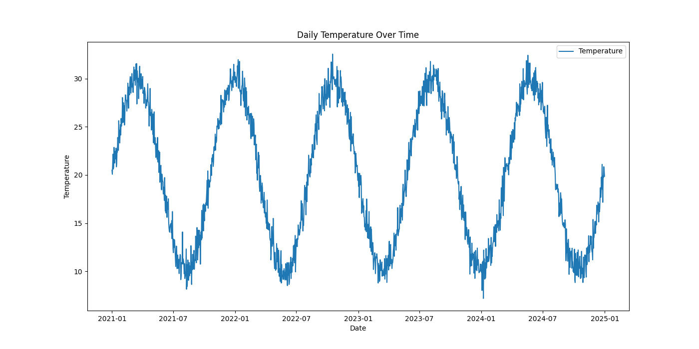
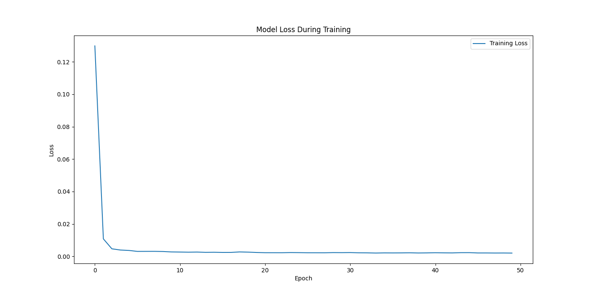
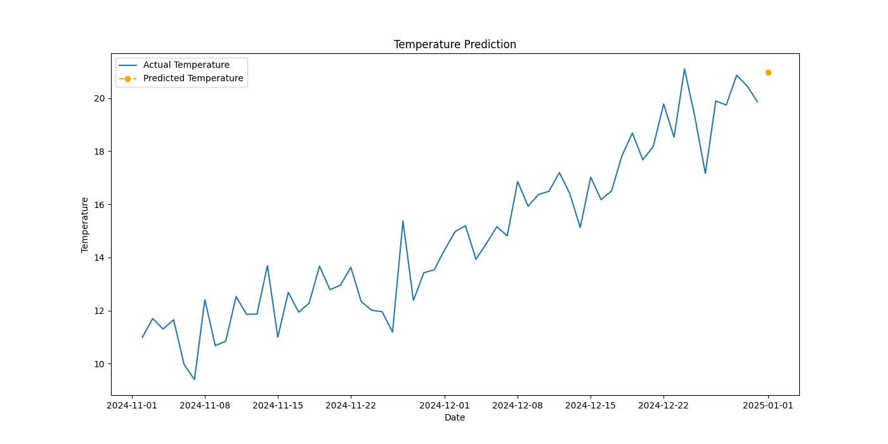

> 这一页把 RNN 的结构、直觉和训练要点重新组织了一遍，便于查阅和分享。

## 快速理解
- 先抓住网络由什么模块组成。
- 再看它解决了什么类型的问题。
- 最后记住训练时最容易出问题的地方。

## 理论基础

### RNN 的数学机制和算法流程

#### 1. 基本结构

RNN的基本单元由一个循环结构组成，它允许信息在网络的时间步骤之间传递。假设我们有一个输入序列 $x = (x_1, x_2, \ldots, x_T) $，RNN通过以下公式来更新其隐藏状态和输出：

**隐藏状态更新****：**

$h_t = f(W_{hh} h_{t-1} + W_{xh} x_t + b_h)$

其中：

- $h_t $是时间步 $t $的隐藏状态。

- $W_{hh} $是隐藏状态到隐藏状态的权重矩阵。

- $W_{xh} $是输入到隐藏状态的权重矩阵。

- $b_h $是偏置项。

- $f $是激活函数（通常是tanh或ReLU）。

**输出计算****：**

$y_t = g(W_{hy} h_t + b_y)$

其中：

- $y_t $是时间步 $t $的输出。

- $W_{hy} $是隐藏状态到输出的权重矩阵。

- $b_y $是偏置项。

- $g $是输出的激活函数（根据任务不同，可能是softmax、sigmoid等）。

#### 2. 前向传播过程

前向传播是通过时间步的顺序计算隐藏状态和输出。具体步骤如下：

1. **初始化隐藏状态**:

$h_0 = 0 \quad \text{(或者是一些初始化值)}$

2. **通过时间步更新隐藏状态和输出**:
对于每个时间步 $t = 1, 2, \ldots, T $：

    - 计算隐藏状态：
    $h_t = f(W_{hh} h_{t-1} + W_{xh} x_t + b_h)$

    - 计算输出：
    $y_t = g(W_{hy} h_t + b_y)$

#### 3. 损失函数和反向传播过程

为了训练RNN，我们需要定义一个损失函数 $L $，并通过反向传播算法来更新网络的权重。假设我们的损失函数是基于整个序列的输出与目标之间的差异。

**总损失**:

$L = \sum_{t=1}^{T} \ell(y_t, \hat{y}_t)$

其中 $\ell $是时间步 $t $的损失（如交叉熵损失），$ \hat{y}_t $是真实值。

**反向传播过程（BPTT，Backpropagation Through Time）**:反向传播通过时间步来计算梯度，并更新权重。

具体步骤如下：

1. **初始化梯度**:

$\frac{\partial L}{\partial W_{hh}} = 0, \quad \frac{\partial L}{\partial W_{xh}} = 0, \quad \frac{\partial L}{\partial W_{hy}} = 0$

2. **通过时间步反向传播误差**:
对于每个时间步 $t = T, T-1, \ldots, 1 $：

    - 计算输出层的梯度：

    $\delta y_t = \frac{\partial \ell(y_t, \hat{y}_t)}{\partial y_t}$

    - 计算隐藏层的梯度（包括时间步的累计梯度）：

    $\delta h_t = \frac{\partial L}{\partial h_t} = \delta y_t W_{hy}^T \cdot g'(h_t) + \delta h_{t+1} W_{hh}^T \cdot f'(h_t)$

    - 累计权重梯度：

$\frac{\partial L}{\partial W_{hy}} += \delta y_t \cdot h_t^T$

$\frac{\partial L}{\partial W_{hh}} += \delta h_t \cdot h_{t-1}^T$

$\frac{\partial L}{\partial W_{xh}} += \delta h_t \cdot x_t^T$

3. **更新权重**（使用梯度下降）：

$W_{hy} \leftarrow W_{hy} - \eta \frac{\partial L}{\partial W_{hy}}$

$W_{hh} \leftarrow W_{hh} - \eta \frac{\partial L}{\partial W_{hh}}$

$W_{xh} \leftarrow W_{xh} - \eta \frac{\partial L}{\partial W_{xh}}$

其中 $\eta $是学习率。

RNN通过循环结构来捕捉序列中的依赖关系，通过前向传播计算隐藏状态和输出，并通过时间反向传播来更新权重。这使得RNN在处理序列数据时可以有效地利用上下文信息。

## Python例子

这里给出一个完整的 RNN 示例，我们将展示如何使用RNN进行时间序列预测，包括以下步骤：

1. **数据准备**：使用一个大数据量的数据集（如气温数据）。

2. **模型构建**：构建RNN模型进行预测。

3. **训练模型**：对模型进行训练，并优化算法。

4. **可视化**：绘制数据分析的图形。

5. **算法优化**：使用一些常见的优化技术。

假设我们使用的是气温时间序列数据集（例如，从某个城市的历史气温数据），这个数据集包含了多年的每日气温记录。

### 1. 数据准备

首先，我们生成一些虚拟的数据集，大家可以随时改动，生成需要的数据。

```Python
import pandas as pd
import numpy as np

# 生成虚拟气温数据
np.random.seed(42)
dates = pd.date_range(start='2021-01-01', end='2024-12-31', freq='D')
temperature = 20 + 10 * np.sin(np.linspace(0, 10 * np.pi, len(dates))) + np.random.normal(0, 1, len(dates))

data = pd.DataFrame({'Date': dates, 'Temperature': temperature})

# 保存为 CSV 文件
data.to_csv('temperature_data.csv', index=False)
```

完整代码：

```Python
import numpy as np
import pandas as pd
import matplotlib.pyplot as plt
from sklearn.preprocessing import MinMaxScaler
import torch
import torch.nn as nn
import torch.optim as optim
from torch.utils.data import DataLoader, TensorDataset

# 读取气温数据集
data = pd.read_csv('temperature_data.csv', parse_dates=['Date'])
data.set_index('Date', inplace=True)
data = data[['Temperature']]

# 可视化原始数据
plt.figure(figsize=(14, 7))
plt.plot(data, label='Temperature')
plt.title('Daily Temperature Over Time')
plt.xlabel('Date')
plt.ylabel('Temperature')
plt.legend()
plt.show()

# 数据标准化
scaler = MinMaxScaler(feature_range=(0, 1))
scaled_data = scaler.fit_transform(data)

# 创建数据集
def create_dataset(dataset, time_step=1):
    X, y = [], []
    for i in range(len(dataset) - time_step):
        X.append(dataset[i:(i + time_step), 0])
        y.append(dataset[i + time_step, 0])
    return np.array(X), np.array(y)

time_step = 60  # 使用过去60天的数据预测下一天
X, y = create_dataset(scaled_data, time_step)
X = X.reshape((X.shape[0], X.shape[1], 1))
```



### 2. 模型构建

构建一个RNN模型进行时间序列预测：

```Python
# 转换为 PyTorch 张量
X_tensor = torch.tensor(X, dtype=torch.float32)
y_tensor = torch.tensor(y, dtype=torch.float32).view(-1, 1)
dataset = TensorDataset(X_tensor, y_tensor)
dataloader = DataLoader(dataset, batch_size=32, shuffle=True)

# 定义 LSTM 模型
class LSTMModel(nn.Module):
    def __init__(self, input_size, hidden_size, output_size, num_layers=2, dropout=0.2):
        super(LSTMModel, self).__init__()
        self.lstm = nn.LSTM(input_size, hidden_size, num_layers=num_layers, batch_first=True, dropout=dropout)
        self.fc = nn.Linear(hidden_size, output_size)

    def forward(self, x):
        out, _ = self.lstm(x)
        out = self.fc(out[:, -1, :])  # 取最后一个时间步的输出
        return out

# 初始化模型
device = torch.device("cuda" if torch.cuda.is_available() else "cpu")
model = LSTMModel(input_size=1, hidden_size=50, output_size=1, num_layers=2, dropout=0.2).to(device)

# 定义损失函数和优化器
criterion = nn.MSELoss()
optimizer = optim.Adam(model.parameters(), lr=0.001)
```

### 3. 模型训练与优化

在训练模型时，我们会记录训练过程中的损失和验证损失，并进行可视化：

```Python
# 训练模型
epochs = 50
train_losses = []

for epoch in range(epochs):
    model.train()
    epoch_loss = 0.0
    for batch_X, batch_y in dataloader:
        batch_X, batch_y = batch_X.to(device), batch_y.to(device)

        optimizer.zero_grad()

        # 训练时不加 no_grad()
        outputs = model(batch_X)
        loss = criterion(outputs, batch_y)

        loss.backward()  # 计算梯度
        optimizer.step()  # 更新参数

        epoch_loss += loss.item()

    avg_loss = epoch_loss / len(dataloader)
    train_losses.append(avg_loss)
    print(f"Epoch {epoch + 1}/{epochs}, Loss: {avg_loss:.4f}")
```

### 4. 预测与可视化

用训练好的模型进行预测，并可视化结果：

```Python
# 创建测试数据集
test_data = data[-time_step:].copy()  # 取最近 time_step 天数据
if len(test_data) < time_step:
    raise ValueError(f"Test data too short: {len(test_data)} samples, but {time_step} needed.")

test_scaled = scaler.transform(test_data)

X_test = test_scaled.reshape(1, time_step, 1)  # 只生成一个测试样本
X_test_tensor = torch.tensor(X_test, dtype=torch.float32).to(device)

# 进行预测
model.eval()
with torch.no_grad():  # 测试时使用 no_grad()
    predicted_scaled = model(X_test_tensor).cpu().numpy()

# 反归一化
predicted = scaler.inverse_transform(predicted_scaled.reshape(-1, 1))

# 可视化训练过程
plt.figure(figsize=(14, 7))
plt.plot(train_losses, label='Training Loss')
plt.title('Model Loss During Training')
plt.xlabel('Epoch')
plt.ylabel('Loss')
plt.legend()
plt.show()

# 反归一化后的预测值
predicted = scaler.inverse_transform(np.squeeze(predicted_scaled).reshape(-1, 1))
plt.figure(figsize=(14, 7))

# 绘制实际温度数据
plt.plot(data.index[-time_step:], data.values[-time_step:], label='Actual Temperature')

# 创建预测时间点的索引，假设我们预测的是实际数据的最后一天后的第二天
predicted_index = data.index[-1] + pd.Timedelta(days=1)

# 绘制预测结果
plt.plot(predicted_index, predicted, label='Predicted Temperature', linestyle='dashed', color='orange', marker='o')

plt.title('Temperature Prediction')
plt.xlabel('Date')
plt.ylabel('Temperature')
plt.legend()
plt.show()
```





## 应用场景

### RNN 适用于哪类问题

RNN主要用于处理和分析序列数据。这类数据的特点是前后项之间存在依赖关系。具体来说，RNN适用于以下类型的问题：

- **时间序列预测**：如股票价格预测、天气预报、传感器数据分析等。

- **自然语言处理（NLP）**：如文本生成、机器翻译、情感分析、语音识别等。

- **视频处理**：如动作识别、视频字幕生成等。

- **生物信息学**：如基因序列分析、蛋白质结构预测等。

### RNN 的优缺点

#### 优点

1. **处理序列数据的能力**：RNN可以捕捉序列中的依赖关系，适合处理时间序列和语言等数据。

2. **参数共享**：RNN在每个时间步使用相同的参数，这使得模型参数数量相对较少，避免了过拟合问题。

3. **在线学习**：RNN可以处理一个时间步接一个时间步的数据，适合于实时数据处理。

#### 缺点

1. **梯度消失和梯度爆炸**：在长序列训练中，反向传播过程中的梯度可能会逐渐消失或爆炸，导致训练困难。

2. **计算复杂度高**：由于序列数据的依赖性，RNN的训练时间较长，计算复杂度较高。

3. **长期依赖问题**：RNN在处理长序列时，可能难以捕捉远距离的依赖关系。

### 运用时的前提条件

1. **序列数据**：RNN适用于有序列依赖关系的数据。如果数据没有明显的时间或序列依赖，RNN的效果可能不佳。

2. **数据预处理**：为了提高RNN的性能，通常需要对输入数据进行归一化、标准化等预处理。

3. **适当的序列长度**：为了避免梯度消失或爆炸问题，通常会将长序列截断成适当长度的小段进行训练。

4. **选择合适的超参数**：如学习率、隐藏层大小、时间步长度等，这些超参数需要通过实验调整以获得最佳效果。