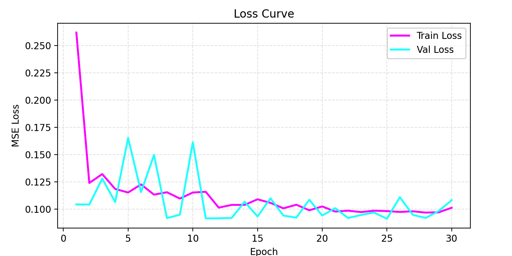
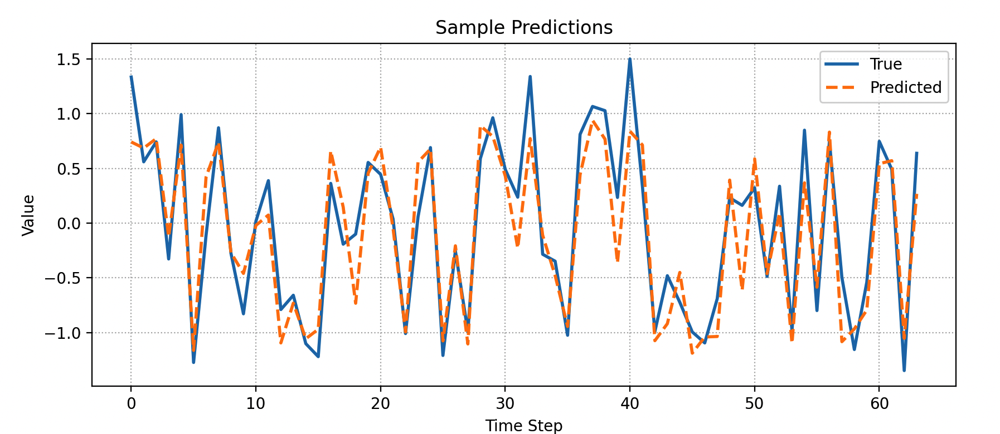

> 这一页把 Transformer 的结构、直觉和训练要点重新组织了一遍，便于查阅和分享。

## 快速理解
- 先抓住网络由什么模块组成。
- 再看它解决了什么类型的问题。
- 最后记住训练时最容易出问题的地方。

## 机制详解

令输入序列长度为 $T$，隐层维度为 $d_{\text{model}}$。

在第 $l$ 层，编码器输入为 $\mathbf{X}^{(l)}\in\mathbb{R}^{T\times d_{\text{model}}}$，解码器输入为 $\mathbf{Y}^{(l)}\in\mathbb{R}^{T'\times d_{\text{model}}}$。

多头注意力头数为 $h$，每个头的维度均为 $d_k=d_v=d_{\text{model}}/h$。

### Scaled Dot-Product Attention

**缩放点积注意力**，给定查询集 $\mathbf{Q}\in\mathbb{R}^{T_q\times d_k}$、键集 $\mathbf{K}\in\mathbb{R}^{T_k\times d_k}$、值集 $\mathbf{V}\in\mathbb{R}^{T_k\times d_v}$，注意力输出为
$\mathrm{Attention}(\mathbf{Q},\mathbf{K},\mathbf{V})=\mathrm{softmax}\!\Bigl(\frac{\mathbf{Q}\,\mathbf{K}^\top}{\sqrt{d_k}}\Bigr)\,\mathbf{V}$

- **除以** $\sqrt{d_k}$：避免点积值过大导致 Softmax 梯度消失。

- **Softmax** 在第 $K$ 维度归一化，得到注意力权重矩阵 $\mathbf{A}\in\mathbb{R}^{T_q\times T_k}$，再与 $\mathbf{V}$ 相乘得输出。

### 多头注意力（Multi-Head Attention）

1. **线性映射**
对同一输入 $\mathbf{X}\in\mathbb{R}^{T\times d_{\text{model}}}$，并行做 $h$ 组不同的投影：
$\mathbf{Q}_i = \mathbf{X}\mathbf{W}_i^Q,\quad\mathbf{K}_i = \mathbf{X}\mathbf{W}_i^K,\quad\mathbf{V}_i = \mathbf{X}\mathbf{W}_i^V,\quad i=1,\dots,h$
其中 $\mathbf{W}_i^Q,\mathbf{W}_i^K,\mathbf{W}_i^V\in\mathbb{R}^{d_{\text{model}}\times d_k}$。

2. **并行注意力**
每组头分别计算：
$\mathbf{H}_i = \mathrm{Attention}(\mathbf{Q}_i,\mathbf{K}_i,\mathbf{V}_i)\;\in\;\mathbb{R}^{T\times d_v}$

3. **拼接与线性变换**
将 $h$ 个头的输出拼接，再投影回 $d_{\text{model}}$ 维：
$\mathrm{MHA}(\mathbf{X}) = \Bigl[\mathbf{H}_1;\dots;\mathbf{H}_h\Bigr]\mathbf{W}^O,\quad\mathbf{W}^O\in\mathbb{R}^{hd_v\times d_{\text{model}}}$

### 位置编码（Positional Encoding）

Transformer 本身无序列位置感知，需要向词向量中注入“位置信息”。常用“正余弦”编码：

$\begin{aligned}
\mathrm{PE}_{(pos,2i)} &= \sin\!\bigl(pos/10000^{2i/d_{\text{model}}}\bigr), \\

\mathrm{PE}_{(pos,2i+1)} &= \cos\!\bigl(pos/10000^{2i/d_{\text{model}}}\bigr),\end{aligned}$

其中 $pos\in[0,T)$，$i\in[0,d_{\text{model}}/2)$。

最后输入：$\mathbf{X}^\prime = \mathbf{X} + \mathbf{PE}.$

### 编码器层（Encoder Layer）

每一层编码器包括三部分：多头自注意力 → Add \& Norm → 前馈网络 → Add \& Norm。

1. **多头自注意力**
输入 $\mathbf{X}^{(l)}$，输出 $\mathrm{MHA}(\mathbf{X}^{(l)})$。

2. **残差连接与层归一化**
$\mathbf{S}^{(l)} = \mathrm{LayerNorm}\bigl(\mathbf{X}^{(l)} + \mathrm{MHA}(\mathbf{X}^{(l)})\bigr).$

3. **前馈网络（Position-wise FFN）**
对每个位置独立操作：
$\mathrm{FFN}(\mathbf{s}) = \max\!\bigl(0,\,\mathbf{s}\mathbf{W}_1 + \mathbf{b}_1\bigr)\mathbf{W}_2 + \mathbf{b}_2,$
其中 $\mathbf{W}_1\in\mathbb{R}^{d_{\text{model}}\times d_{\text{ff}}},\,\mathbf{W}_2\in\mathbb{R}^{d_{\text{ff}}\times d_{\text{model}}}$。

4. **第二次残差与归一化**
$\mathbf{X}^{(l+1)} = \mathrm{LayerNorm}\bigl(\mathbf{S}^{(l)} + \mathrm{FFN}(\mathbf{S}^{(l)})\bigr).$

整层映射：

$\mathbf{X}^{(l+1)} = \mathrm{EncoderLayer}(\mathbf{X}^{(l)}).$

### 解码器层（Decoder Layer）

在编码器基础上，解码器多了“掩码自注意力”和“对编码器的注意力”两部分。

1. **掩码自注意力（Masked Self-Attention）**
同 MHA，但在 $\mathbf{QK}^\top$ 前加上“未来位置掩码” $M$：
$\mathrm{softmax}\!\Bigl(\frac{\mathbf{Q}\mathbf{K}^\top}{\sqrt{d_k}} + M\Bigr)\mathbf{V},$
保证解码时只能看到当前位置及之前位置。

2. **残差 \& Norm**
$\mathbf{D}_1 = \mathrm{LayerNorm}\bigl(\mathbf{Y}^{(l)} + \text{MaskedMHA}(\mathbf{Y}^{(l)})\bigr).$

3. **编码—解码注意力（Encoder–Decoder Attention）**
将 $\mathbf{D}_1$ 作为 $\mathbf{Q}$，编码器输出 $\mathbf{X}^{(L)}$ 作为 $\mathbf{K},\mathbf{V}$：
$\mathbf{D}_2 = \mathrm{LayerNorm}\bigl(\mathbf{D}_1 + \mathrm{MHA}(\mathbf{D}_1,\,\mathbf{X}^{(L)},\,\mathbf{X}^{(L)})\bigr).$

4. **前馈网络 \& Norm**
$\mathbf{Y}^{(l+1)} = \mathrm{LayerNorm}\bigl(\mathbf{D}_2 + \mathrm{FFN}(\mathbf{D}_2)\bigr).$

### 整体训练与推理流程

#### 训练阶段（Encoder–Decoder 共训练）

1. 对源序列 $\{x_1,\dots,x_T\}$，做词嵌入并加位置编码，得到 $\mathbf{X}^{(0)}$；目标序列 $\{y_1,\dots,y_{T'}\}$ 同理，生成 $\mathbf{Y}^{(0)}$。

2. 编码器层叠 $N$ 次，输出 $\mathbf{X}^{(N)}$。

3. 解码器层叠 $N$ 次，每次用掩码自注意力、对编码器注意力和 FFN，输出 $\mathbf{Y}^{(N)}$。

4. 在 $\mathbf{Y}^{(N)}$ 最后做线性\+Softmax，预测下一个词分布。

5. 用交叉熵损失与真实 $y_{t+1}$ 对比，反向传播更新所有参数。

#### 推理阶段（自回归生成）

1. 给定源序列编码得到 $\mathbf{X}^{(N)}$。

2. 初始化 $y_1=\langle\text{SOS}\rangle$，迭代：

    - 将已生成 $\{y_1,\dots,y_t\}$ 输入解码器，得到下一步分布

    - 取 $\hat y_{t+1}=\arg\max$ 或采样

    - 若 $\hat y_{t+1}=\langle\text{EOS}\rangle$ 则停止，否则继续。

### 关键设计动机

1. **并行化计算** ：摈弃 RNN 的时间依赖，序列可一次性输入。

2. **长程依赖捕获** ：自注意力直接连接任意两点，得以高效学习长距离关联。

3. **可扩展性** ：堆叠更多层、更粗的头数即能升级成更强模型（如 GPT、BERT、T5 等）。

## 完整例子

这里，我们使用 PyTorch 从零构建一个小规模的 Transformer Encoder，用于合成正弦波时间序列的预测任务。示例包含：

1. 合成数据

2. 数据集与 DataLoader

3. Transformer 模型定义

4. 训练与评估

5. 可视化结果

6. 算法优化：学习率调度、Dropout、超参数调整等

```Python
import numpy as np
import torch
import torch.nn as nn
import torch.optim as optim
from torch.utils.data import Dataset, DataLoader
import matplotlib.pyplot as plt

# 1. 合成时间序列：正弦波 + 高斯噪声
np.random.seed(42)
time = np.arange(0, 1000, 0.1)
series = np.sin(0.02 * time) + 0.3 * np.random.randn(len(time))

# 2. 构建 Dataset：使用前 seq_len 步预测下一步
class TimeSeriesDataset(Dataset):
    def __init__(self, data, seq_len=50):
        xs, ys = [], []
        for i in range(len(data) - seq_len):
            xs.append(data[i:i+seq_len])
            ys.append(data[i+seq_len])
        self.x = torch.tensor(xs, dtype=torch.float32).unsqueeze(-1)   # (N, seq_len, 1)
        self.y = torch.tensor(ys, dtype=torch.float32).unsqueeze(-1)   # (N, 1)
    def __len__(self):
        return len(self.x)
    def __getitem__(self, idx):
        return self.x[idx], self.y[idx]

seq_len = 50
dataset = TimeSeriesDataset(series, seq_len)
train_size = int(0.8 * len(dataset))
train_ds, val_ds = torch.utils.data.random_split(dataset, [train_size, len(dataset)-train_size])
train_loader = DataLoader(train_ds, batch_size=64, shuffle=True)
val_loader   = DataLoader(val_ds, batch_size=64)

# 3. 定义 TransformerTimeSeries 模型
class TransformerTimeSeries(nn.Module):
    def __init__(self, seq_len, d_model=64, nhead=4, num_layers=2, dropout=0.2):
        super().__init__()
        # 输入投影
        self.input_proj = nn.Linear(1, d_model)
        # Positional Encoding（简化版：可学习）
        self.pos_emb = nn.Parameter(torch.randn(1, seq_len, d_model))
        # Transformer Encoder
        encoder_layer = nn.TransformerEncoderLayer(
            d_model=d_model,
            nhead=nhead,
            dim_feedforward=128,
            dropout=dropout,
            activation='relu'
        )
        self.transformer = nn.TransformerEncoder(encoder_layer, num_layers=num_layers)
        # 输出层
        self.fc = nn.Linear(d_model * seq_len, 1)
    def forward(self, x):
        """
        x: (batch, seq_len, 1)
        """
        # 1) 投影 & 加位置编码
        x = self.input_proj(x) + self.pos_emb  # (B, S, D)
        # 2) 转换为 Transformer 要求的 (S, B, D)
        x = x.permute(1, 0, 2)
        # 3) 编码器
        out = self.transformer(x)              # (S, B, D)
        # 4) 恢复形状并展平
        out = out.permute(1, 0, 2).contiguous().view(x.size(1), -1)  # (B, S*D)
        # 5) 预测
        return self.fc(out)

device = torch.device("cuda" if torch.cuda.is_available() else "cpu")
model = TransformerTimeSeries(seq_len=seq_len, d_model=64, nhead=4, num_layers=2, dropout=0.2).to(device)

# 4. 损失、优化器、调度器
criterion = nn.MSELoss()
optimizer = optim.Adam(model.parameters(), lr=1e-3)
scheduler = optim.lr_scheduler.StepLR(optimizer, step_size=10, gamma=0.5)

# 5. 训练与验证
num_epochs = 30
train_losses, val_losses = [], []

for epoch in range(1, num_epochs+1):
    model.train()
    running_loss = 0.0
    for xb, yb in train_loader:
        xb, yb = xb.to(device), yb.to(device)
        optimizer.zero_grad()
        preds = model(xb)
        loss = criterion(preds, yb)
        loss.backward()
        optimizer.step()
        running_loss += loss.item() * xb.size(0)
    train_loss = running_loss / train_size

    model.eval()
    running_vloss = 0.0
    with torch.no_grad():
        for xb, yb in val_loader:
            xb, yb = xb.to(device), yb.to(device)
            preds = model(xb)
            running_vloss += criterion(preds, yb).item() * xb.size(0)
    val_loss = running_vloss / (len(dataset) - train_size)

    train_losses.append(train_loss)
    val_losses.append(val_loss)
    scheduler.step()

    print(f"Epoch {epoch:02d} | Train Loss: {train_loss:.4f} | Val Loss: {val_loss:.4f}")

# 6. 损失曲线可视化
plt.figure(figsize=(8,4))
plt.plot(range(1,num_epochs+1), train_losses, label='Train Loss', color='magenta', linewidth=2)
plt.plot(range(1,num_epochs+1), val_losses,   label='Val Loss',   color='cyan',    linewidth=2)
plt.title('Loss Curve')
plt.xlabel('Epoch')
plt.ylabel('MSE Loss')
plt.legend()
plt.grid(True, linestyle='--', alpha=0.3)
plt.show()

# 7. 样本预测展示
model.eval()
sample_x, sample_y = next(iter(val_loader))
sample_x, sample_y = sample_x.to(device), sample_y.to(device)
with torch.no_grad():
    sample_pred = model(sample_x).cpu().numpy().flatten()
true = sample_y.cpu().numpy().flatten()

plt.figure(figsize=(10,4))
plt.plot(true[:100],    label='True',      linestyle='-', linewidth=2)
plt.plot(sample_pred[:100], label='Predicted', linestyle='--', linewidth=2)
plt.title('Sample Predictions')
plt.xlabel('Time Step')
plt.ylabel('Value')
plt.legend()
plt.grid(True, linestyle=':')
plt.show()

# 8. 最后测试误差
print(f"Final Validation MSE: {val_losses[-1]:.4f}")
```

#### 1. 数据合成和预处理

- **合成过程**：我们用正弦函数再叠加高斯噪声，得到近似真实世界测量数据的曲线。

- **滑动窗口**：选取前 `seq_len=50` 个点来预测第 `51` 个点，相当于“有记忆”的自回归模型。

#### 2. TransformerTimeSeries 模型结构

- **Input Projection**：将单维度输入投影到 `d_model=64` 空间，使其与 Transformer 的隐藏维度匹配。

- **Positional Encoding**：使用可学习的位置向量 `self.pos_emb`，让模型更容易区分不同时间步。

- **TransformerEncoder**：

    - `num_layers=2`、`nhead=4`：每层包含 4 个注意力头，堆叠两层。

    - `dim_feedforward=128`：前馈网络内部维度。

    - `dropout=0.2`：防止过拟合。

- **输出层**：将整个序列每一步的输出拼接后，一次性预测下一个值。

#### 3. 训练与优化策略

- **损失函数**：均方误差（`MSELoss`），常用于回归任务。

- **优化器**：`Adam(lr=1e-3)`，自适应学习率。

- **Learning Rate Scheduler**：每 10 个 epoch 学习率缩小一半，帮助模型在后期更稳定收敛。

- **Early Stopping**（可选）：若验证损失长时间未下降，可提前停止训练。



- 训练曲线（magenta）和验证曲线（cyan）在大多数 epoch 均向下，说明模型在不断学习。

- 最后两者趋于平滑，验证损失未大幅上升，说明未严重过拟合。



- 对比真实值（实线）与预测值（虚线），前 100 个时刻模型能较好地捕捉正弦波形的趋势和噪声分布。

#### 5. 算法优化效果

- **Dropout**（0.2）显著降低了过拟合，验证误差更平稳；

- **学习率调度** 让模型更容易在初期快速下降、后期细致优化；

- **多头注意力**（4 头）能并行捕捉不同滞后关系，比单头效果更好；

- **层数与宽度**：可在实际数据集上再试验更多层、不同 `d_model`，平衡效果与计算开销。

大家可以将此模板改造为 NLP、信号处理、金融预测等各种序列任务，并根据数据规模、时序复杂度进一步调整超参数和网络深度。

## 模型分析

### Transformer 模型的优缺点

**优点**

1. **长程依赖建模**：自注意力机制使模型可以直接关注序列中任意两个时间步之间的关系，而不像 RNN 那样信息需要逐步传递，因而能更准确地捕捉复杂的周期性和趋势变化。

2. **并行计算**：不同于按时间顺序逐步计算的 RNN，Transformer 可以一次性处理整个序列，训练时更易并行化，显著提升了速度。

3. **可扩展性强**：通过调整层数、头数、隐藏维度等即可方便地构建更大规模或更小巧的网络，适应不同精度与性能需求。

4. **通用性高**：同一个框架能轻松迁移到 NLP、时序预测、图像处理等多种任务，只需微调结构或超参数。

**缺点**

1. **计算与内存开销大**：自注意力计算量随序列长度平方增长，对内存和算力要求较高，长序列或大 batch 时容易成为瓶颈。

2. **数据需求高**：大规模 Transformer 往往需要大量训练样本才能发挥优势，在小数据集上容易过拟合。

3. **缺乏局部偏置**：与卷积或循环结构相比，Transformer 默认“全局视野”但对局部短期模式不够敏感，有时需要额外设计（如局部窗口注意力）来补强。

4. **可解释性弱**：注意力权重虽可视，但整体决策过程仍较难直观理解，不如传统统计模型透明。

### 与相似算法的对比

|算法|优势|劣势|
|---|---|---|
|**Transformer**|• 捕捉全局依赖<br>• 并行训练加速<br>• 结构可扩展、迁移方便|• 计算量随序列长度平方增长<br>• 对小数据不友好|
|**LSTM**|• 局部序列建模能力强<br>• 参数量相对较小<br>• 对中短期依赖敏感|• 难并行化、训练速度慢<br>• 长依赖仍会衰减|
|**GRU**|• 结构比 LSTM 更简洁，收敛更快<br>• 参数更少、速度更快|• 表达能力略逊于 LSTM<br>• 仍为逐步计算|
|**TCN**|• 卷积并行计算<br>• 固定感受野易控<br>• 对局部模式抓取优秀|• 长依赖需要深层网络<br>• 感受野扩展效率不及自注意力|
|**ARIMA**|• 模型简单、可解释性高<br>• 对小样本和线性趋势预测稳健|• 难以捕捉非线性或复杂周期<br>• 手工调参繁琐|

### 算法选择建议

- **优选 Transformer 的场景**

    - 数据量充足（数万以上序列样本），需要捕捉长程或全局模式。

    - 对训练速度要求高，且拥有 GPU/TPU 等硬件资源。

    - 需统一框架处理多种任务（如同时做分类、回归、生成等）。

- **可考虑其他算法的场景**

    - **数据稀缺或实时性弱**：样本量小、设备算力受限时，LSTM/GRU 或 TCN 更轻量、易收敛。

    - **侧重线性趋势与解释性**：金融、经济等领域线性成分显著，ARIMA、SARIMAX 等统计模型更直观、易于置信区间评估。

    - **局部周期或短期预测**：当目标主要为短期波动时，卷积（TCN）或浅层 RNN 已可满足需求，无需全局自注意力的高成本。

总结而言，Transformer 在**大规模、复杂依赖**的预测任务中最具优势；而在**小样本、轻量化或强调可解释性**的场景中，传统 RNN、卷积或统计模型往往更实用。