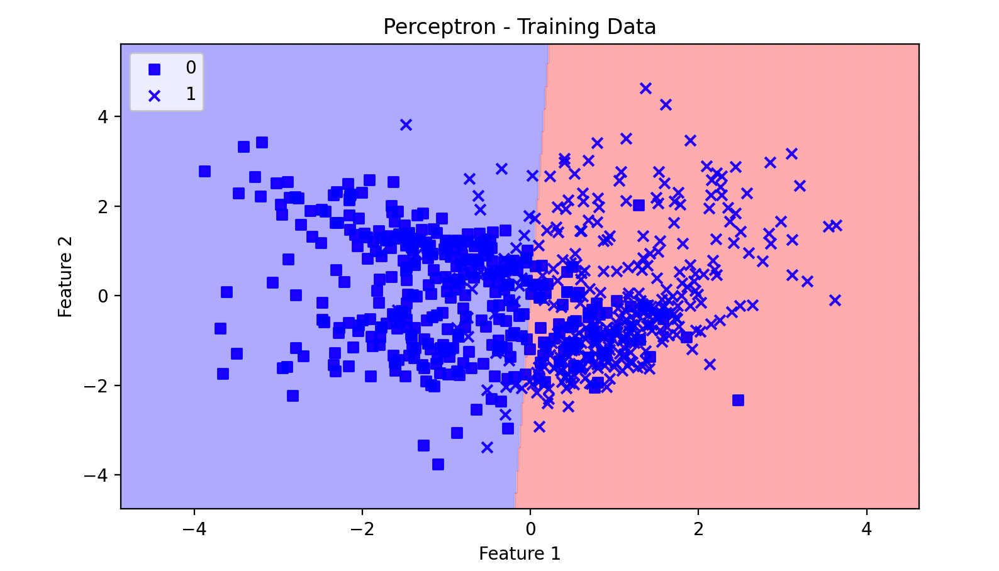
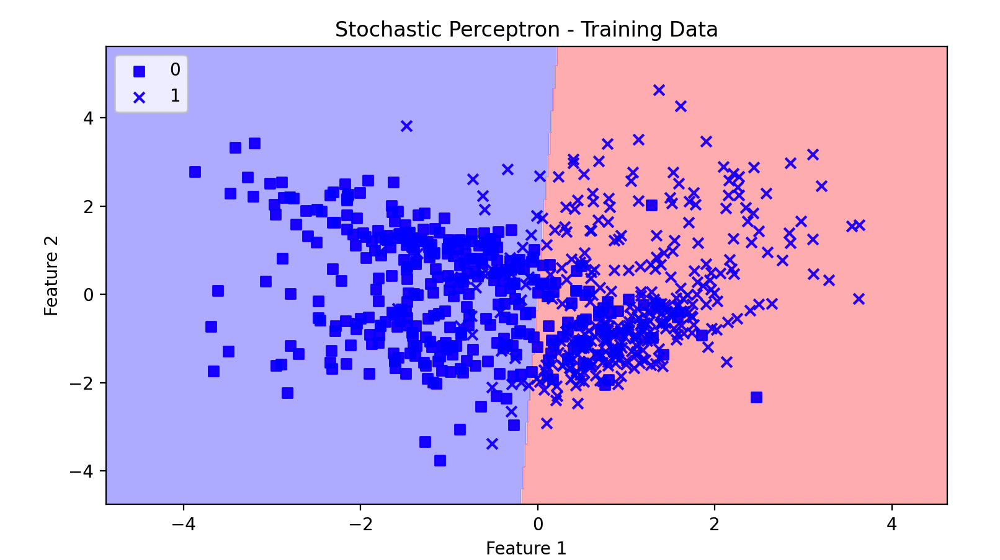

> 这一页把 感知机 的结构、直觉和训练要点重新组织了一遍，便于查阅和分享。

## 快速理解
- 先抓住网络由什么模块组成。
- 再看它解决了什么类型的问题。
- 最后记住训练时最容易出问题的地方。

大家好，我们今天聊聊感知机~

先用一句话抓住它：**感知机是一种简单的线性分类器，它用于二分类任务。它是神经网络的基本单元，被认为是人工神经网络的基础。**

感知机模型通过线性函数对输入数据进行分类，使用的是如下公式：

$f(\mathbf{x}) = 
\begin{cases}
1 & \text{if } \mathbf{w} \cdot \mathbf{x} + b > 0 \\
0 & \text{otherwise}
\end{cases}$

其中，$\mathbf{x}$ 是输入特征向量，$\mathbf{w}$ 是权重向量，$b$ 是偏置。感知机的目标是找到一组权重和偏置，使得输入特征向量通过线性函数得到的输出可以正确地分类为0或1。

### 历史背景

感知机由美国心理学家弗兰克·罗森布拉特 (Frank Rosenblatt) 于1957年提出，作为模拟人类大脑信息处理机制的一种尝试。罗森布拉特在康奈尔航空实验室（Cornell Aeronautical Laboratory）开发了感知机，并用硬件实现了一个名为“Mark I”的设备。这台设备被认为是世界上第一个神经网络硬件。

**关键事件和发展：**

1. **1957年** - 弗兰克·罗森布拉特提出感知机模型，并且在随后的几年中进行了大量实验，试图证明感知机在模式识别任务中的有效性。

2. **1969年** - Marvin Minsky 和 Seymour Papert 在他们的著作《感知机》(Perceptrons) 中指出了感知机的局限性，特别是它无法解决非线性可分问题，例如 XOR 问题。他们的批评使得对神经网络的研究在接下来的十几年中陷入低潮。

3. **1980年代** - 由于多层感知机（MLP）和反向传播算法的发展，神经网络研究重新获得了关注。多层感知机通过增加隐藏层，可以解决感知机的局限性，处理非线性可分问题。

4. **现代发展** - 尽管感知机本身作为一个简单的线性分类器有其局限性，但它作为神经网络和机器学习领域的奠基石，对后来的研究产生了深远的影响。现代神经网络的发展和深度学习技术的兴起，都可以追溯到感知机的早期研究。

### 理论基础

#### 数学机制

感知机是一个线性分类器，主要用于二分类问题。它通过计算输入特征的加权和，并应用一个阶跃函数来决定输出类别。其数学机制包括以下几个部分：

**1. 线性组合**：

给定一个输入向量 $\mathbf{x} = [x_1, x_2, \ldots, x_n]$ 和权重向量 $\mathbf{w} = [w_1, w_2, \ldots, w_n]$，感知机计算输入特征的加权和，加上一个偏置 $b$：
$z = \mathbf{w} \cdot \mathbf{x} + b = \sum_{i=1}^n w_i x_i + b$

**2. 激活函数**：

感知机使用阶跃函数作为激活函数，将加权和 $z$ 转换为输出类别 $y$。

阶跃函数定义如下：

$f(z) = \begin{cases}1 & \text{if } z \geq 0 \\0 & \text{if } z < 0\end{cases}$

**3. 决策边界**：

感知机模型实际上定义了一个线性决策边界，将输入空间分为两个区域。

决策边界的方程是：

$\mathbf{w} \cdot \mathbf{x} + b = 0$

在决策边界上，加权和 $z$ 正好为0，感知机无法确定输入属于哪一类。

#### 算法流程

**感知机算法主要包括两个阶段：训练阶段和预测阶段。**

训练阶段旨在调整权重和偏置，使得模型可以正确分类训练数据；预测阶段使用训练好的模型对新数据进行分类。

**1. 初始化**：

- 初始化权重向量 $\mathbf{w}$ 和偏置 $b$ 为零或小的随机值。

- 设定学习率 $\eta$ 和迭代次数 $n_iter$。

**2. 训练阶段**：

- **输入**：训练数据集 $\{(\mathbf{x}^{(i)}, y^{(i)})\}_{i=1}^{m}$，其中 $\mathbf{x}^{(i)}$ 是第 $i$ 个样本的特征向量，$y^{(i)}$ 是其对应的标签（0或1）。

- **迭代**：对于每次迭代：

    - 对于每个样本 $(\mathbf{x}^{(i)}, y^{(i)})$：

    - **1. 计算输出**：使用当前的权重和偏置计算感知机的输出：
    $\hat{y}^{(i)} = f(\mathbf{w} \cdot \mathbf{x}^{(i)} + b)$
    **2. 更新权重和偏置**：根据预测输出与实际标签之间的差异进行更新。更新规则如下：
    $\mathbf{w} \leftarrow \mathbf{w} + \eta (y^{(i)} - \hat{y}^{(i)}) \mathbf{x}^{(i)}$
    $b \leftarrow b + \eta (y^{(i)} - \hat{y}^{(i)})$

        - **计算误差**：累计本次迭代中的分类错误次数。

**3. 预测阶段**：

- **输入**：新的输入特征向量 $\mathbf{x}$。

- **计算输出**：使用训练好的权重和偏置进行预测：$\hat{y} = f(\mathbf{w} \cdot \mathbf{x} + b)$

- **输出**：预测类别 $\hat{y}$。

#### 算法流程图

1. **初始化**：

    $\mathbf{w} \leftarrow 0$

    $b \leftarrow 0$

    $\eta \leftarrow 0.01$

    $n_iter \leftarrow 50$

2. **训练**：

```Plaintext
For epoch in range(n_iter):
    error_count = 0
    For each sample (x_i, y_i) in training_set:
        z = np.dot(w, x_i) + b
        y_pred = 1 if z >= 0 else 0
        if y_pred != y_i:
            w += η * (y_i - y_pred) * x_i
            b += η * (y_i - y_pred)
            error_count += 1
    if error_count == 0:
        break
```

1. **预测**：

```Plaintext
def predict(x):
    z = np.dot(w, x) + b
    return 1 if z >= 0 else 0
```

通过上述步骤，感知机可以根据训练数据调整权重和偏置，使得模型可以正确分类新的输入数据。感知机的关键思路是利用梯度下降法不断更新模型参数，以最小化分类错误。尽管感知机仅适用于线性可分的数据，但其简单性和可解释性使其成为机器学习和神经网络研究的基础模型。

### 应用场景

**适用问题**

感知机适用于二分类问题，尤其是线性可分的数据集。即，当数据点可以通过一条直线（或高维空间中的超平面）完全分开时，感知机可以有效地工作。

**优点**

1. **简单易实现**：感知机的算法机制和实现都非常简单，适合初学者理解和学习。

2. **快速计算**：由于只涉及线性运算，计算速度快，适合处理小规模数据集。

3. **可解释性强**：感知机的决策边界是一个线性超平面，易于可视化和解释。

**缺点**

1. **仅适用于线性可分数据**：感知机无法处理非线性可分的数据集，例如XOR问题。

2. **无法解决多分类问题**：单一感知机仅适用于二分类任务，处理多分类问题时需要使用多个感知机或其他算法。

3. **对噪声敏感**：感知机对数据中的噪声和异常值较为敏感，可能影响分类效果。

#### 实际应用例子

1. **邮件垃圾分类**：

    - 使用感知机分类器区分垃圾邮件和正常邮件。特征可以包括邮件的单词频率、发送时间等。

2. **信用卡欺诈检测**：

    - 使用感知机模型检测信用卡交易中的欺诈行为。特征可以包括交易金额、时间、地点等。

3. **图像边缘检测**：

    - 使用感知机检测图像中的边缘和线条。通过对像素值的特征提取，感知机可以识别图像中的直线边缘。

4. **市场营销中的客户分类**：

    - 使用感知机将客户分类为潜在客户和非潜在客户。特征可以包括客户的购买历史、浏览行为、人口统计数据等。

**感知机在实际中的应用举例**

**邮件垃圾分类**：

```Python
from sklearn.linear_model import Perceptron
from sklearn.feature_extraction.text import TfidfVectorizer
from sklearn.model_selection import train_test_split
from sklearn.metrics import classification_report

# 样例数据
emails = ["Free money", "Limited offer", "Meet singles in your area", "Normal email content", "Work meeting agenda"]
labels = [1, 1, 1, 0, 0]  # 1 表示垃圾邮件，0 表示正常邮件

# 特征提取
vectorizer = TfidfVectorizer()
X = vectorizer.fit_transform(emails)

# 数据集划分
X_train, X_test, y_train, y_test = train_test_split(X, labels, test_size=0.3, random_state=42)

# 训练感知机模型
model = Perceptron()
model.fit(X_train, y_train)

# 预测与评估
y_pred = model.predict(X_test)
print(classification_report(y_test, y_pred))
```

**信用卡欺诈检测**：

```Python
import numpy as np
from sklearn.linear_model import Perceptron
from sklearn.model_selection import train_test_split
from sklearn.preprocessing import StandardScaler
from sklearn.metrics import accuracy_score

# 样例数据 (特征包括交易金额、时间等)
transactions = np.array([[100, 1], [200, 0], [50, 1], [500, 0], [30, 1], [3000, 0]])
labels = np.array([0, 0, 1, 0, 1, 1])  # 1 表示欺诈，0 表示正常

# 数据标准化
scaler = StandardScaler()
transactions_scaled = scaler.fit_transform(transactions)

# 数据集划分
X_train, X_test, y_train, y_test = train_test_split(transactions_scaled, labels, test_size=0.3, random_state=42)

# 训练感知机模型
model = Perceptron()
model.fit(X_train, y_train)

# 预测与评估
y_pred = model.predict(X_test)
print(f'Accuracy: {accuracy_score(y_test, y_pred):.2f}')
```

这些例子展示了感知机在实际中的一些应用场景。通过选择合适的特征和预处理步骤，感知机可以在简单的二分类问题中发挥作用。

### Python例子

这里，我们举例一个完整的感知机模型示例，包括训练数据、模型训练、可视化和算法优化。

代码中，使用一个简单的二分类数据集，并利用Matplotlib进行数据和决策边界的可视化。

#### 1. 导入所需的库

```Python
import numpy as np
import matplotlib.pyplot as plt
from sklearn.datasets import make_classification
from sklearn.model_selection import train_test_split
from sklearn.metrics import accuracy_score
```

#### 2. 创建数据集

我们使用`make_classification`函数生成一个简单的二分类数据集。

```Python
# 创建二分类数据集
X, y = make_classification(n_samples=100, n_features=2, n_informative=2, n_redundant=0, random_state=1)

# 将数据分为训练集和测试集
X_train, X_test, y_train, y_test = train_test_split(X, y, test_size=0.3, random_state=1)
```

#### 3. 感知机模型实现

以下是感知机的实现，包括训练过程和预测函数。

```Python
class Perceptron:
    def __init__(self, learning_rate=0.01, n_iter=50):
        self.learning_rate = learning_rate
        self.n_iter = n_iter

    def fit(self, X, y):
        self.weights = np.zeros(X.shape[1] + 1)
        self.errors = []

        for _ in range(self.n_iter):
            error = 0
            for xi, target in zip(X, y):
                update = self.learning_rate * (target - self.predict(xi))
                self.weights[1:] += update * xi
                self.weights[0] += update
                error += int(update != 0.0)
            self.errors.append(error)
        return self

    def net_input(self, X):
        return np.dot(X, self.weights[1:]) + self.weights[0]

    def predict(self, X):
        return np.where(self.net_input(X) >= 0.0, 1, 0)
```

#### 4. 训练感知机模型

```Python
perceptron = Perceptron(learning_rate=0.01, n_iter=10)
perceptron.fit(X_train, y_train)
```

#### 5. 可视化决策边界

```Python
# 定义画决策边界的函数
def plot_decision_regions(X, y, classifier, resolution=0.02):
    markers = ('s', 'x', 'o', '^', 'v')
    colors = ('red', 'blue', 'lightgreen', 'gray', 'cyan')
    cmap = plt.cm.bwr

    # 画决策边界
    x1_min, x1_max = X[:, 0].min() - 1, X[:, 0].max() + 1
    x2_min, x2_max = X[:, 1].min() - 1, X[:, 1].max() + 1
    xx1, xx2 = np.meshgrid(np.arange(x1_min, x1_max, resolution),
                           np.arange(x2_min, x2_max, resolution))
    Z = classifier.predict(np.array([xx1.ravel(), xx2.ravel()]).T)
    Z = Z.reshape(xx1.shape)
    plt.contourf(xx1, xx2, Z, alpha=0.3, cmap=cmap)
    plt.xlim(xx1.min(), xx1.max())
    plt.ylim(xx2.min(), xx2.max())

    # 画样本点
    for idx, cl in enumerate(np.unique(y)):
        plt.scatter(x=X[y == cl, 0], y=X[y == cl, 1],
                    alpha=0.8, c=cmap(idx),
                    marker=markers[idx], label=cl)

# 画决策边界
plot_decision_regions(X_train, y_train, classifier=perceptron)
plt.title('Perceptron - Training Data')
plt.xlabel('Feature 1')
plt.ylabel('Feature 2')
plt.legend(loc='upper left')
plt.show()
```



#### 6. 评估模型性能

```Python
y_pred = perceptron.predict(X_test)
print(f'Accuracy: {accuracy_score(y_test, y_pred):.2f}')
```

#### 7. 算法优化

感知机的优化可以通过调整学习率、迭代次数，或者使用改进的版本如带有随机梯度下降的感知机。

```Python
class StochasticPerceptron(Perceptron):
    def fit(self, X, y):
        self.weights = np.zeros(X.shape[1] + 1)
        self.errors = []

        for _ in range(self.n_iter):
            error = 0
            for xi, target in zip(X, y):
                update = self.learning_rate * (target - self.predict(xi))
                self.weights[1:] += update * xi
                self.weights[0] += update
                error += int(update != 0.0)
            self.errors.append(error)
        return self

# 使用改进的感知机进行训练
stochastic_perceptron = StochasticPerceptron(learning_rate=0.01, n_iter=10)
stochastic_perceptron.fit(X_train, y_train)

# 可视化改进的感知机决策边界
plot_decision_regions(X_train, y_train, classifier=stochastic_perceptron)
plt.title('Stochastic Perceptron - Training Data')
plt.xlabel('Feature 1')
plt.ylabel('Feature 2')
plt.legend(loc='upper left')
plt.show()

# 评估改进后的模型性能
y_pred = stochastic_perceptron.predict(X_test)
print(f'Stochastic Perceptron Accuracy: {accuracy_score(y_test, y_pred):.2f}')
```



这个示例展示了如何使用Python实现和训练一个感知机模型，并进行了简单的优化和可视化。

可以看到，感知机的实现和使用相对简单，但对于线性可分的数据有很好的分类效果。通过优化和改进算法，可以进一步提升模型性能。