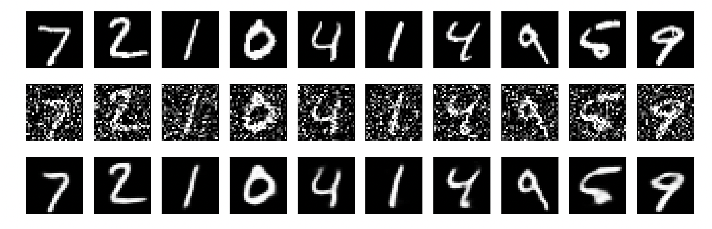
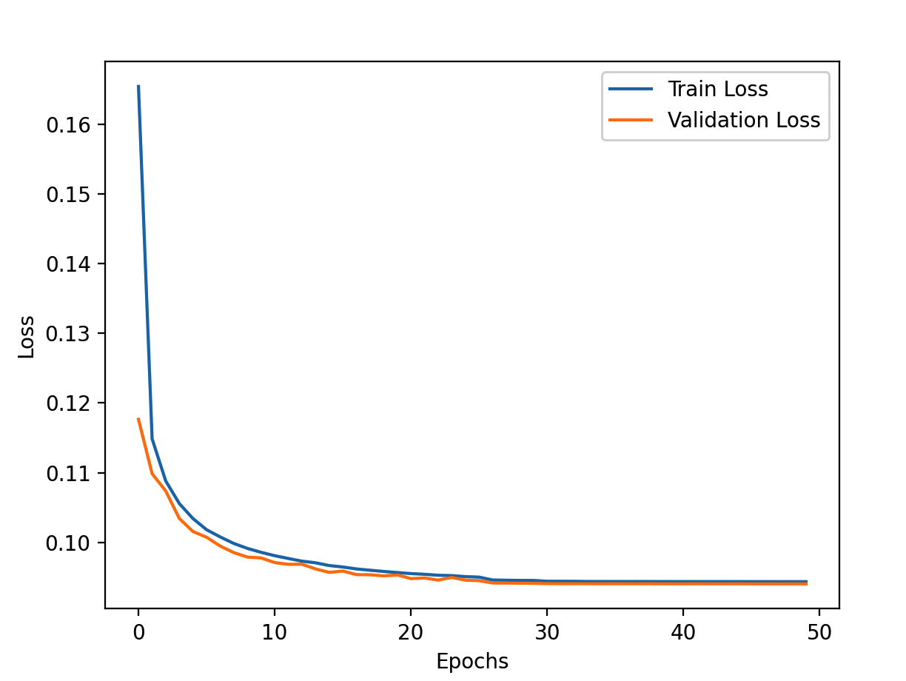

> 这一页把 自编码器 的结构、直觉和训练要点重新组织了一遍，便于查阅和分享。

## 快速理解
- 先抓住网络由什么模块组成。
- 再看它解决了什么类型的问题。
- 最后记住训练时最容易出问题的地方。

## 理论基础

自编码器是一种无监督学习算法，通常用于特征学习和数据降维。它的两个主要部分组成：编码器和解码器。我们可以详细描述其机制和算法流程。

**1. 编码器（Encoder）**

编码器将输入数据 $\mathbf{x} $映射到一个低维的隐藏表示 $\mathbf{z} $：

$\mathbf{z} = f(\mathbf{x})$

这里，$ f $通常是一个多层神经网络。具体来说，假设我们有一个包含 $L $层的神经网络，那么编码器的输出可以表示为：
$\mathbf{z} = f(\mathbf{x}) = f_L(f_{L-1}(\cdots f_2(f_1(\mathbf{x}))\cdots))$

其中，每一层的计算公式为：

$\mathbf{h}^{(i)} = \sigma(\mathbf{W}^{(i)} \mathbf{h}^{(i-1)} + \mathbf{b}^{(i)})$

这里：

- $\mathbf{h}^{(0)} = \mathbf{x}$

- $\mathbf{W}^{(i)} $是第 $i $层的权重矩阵

- $\mathbf{b}^{(i)} $是第 $i $层的偏置向量

- $\sigma $是激活函数（例如ReLU、Sigmoid或Tanh）

编码器的输出 $\mathbf{z} $是输入数据的低维表示。

**2. 解码器（Decoder）**

解码器将低维的隐藏表示 $\mathbf{z} $重新映射回原始数据空间，得到重构数据 $\mathbf{\hat{x}} $：

$\mathbf{\hat{x}} = g(\mathbf{z})$

类似于编码器，解码器通常也是一个多层神经网络。

假设解码器也包含 $L $层，那么解码器的输出可以表示为：

$\mathbf{\hat{x}} = g(\mathbf{z}) = g_1(g_2(\cdots g_{L-1}(g_L(\mathbf{z}))\cdots))$

其中，每一层的计算公式为：

$\mathbf{h}^{(i)} = \sigma(\mathbf{W}^{(i)} \mathbf{h}^{(i-1)} + \mathbf{b}^{(i)})$

这里：

- $\mathbf{h}^{(0)} = \mathbf{z}$

- $\mathbf{W}^{(i)}$是第 $i $层的权重矩阵

- $\mathbf{b}^{(i)}$是第 $i $层的偏置向量

- $\sigma$是激活函数

解码器的输出 $\mathbf{\hat{x}} $是对输入数据的重构。

**3. 损失函数（Loss Function）**

自编码器的目标是使重构数据 $\mathbf{\hat{x}} $尽可能接近输入数据 $\mathbf{x} $。为此，我们需要定义一个损失函数来度量两者之间的差异。最常用的损失函数是均方误差（MSE）：

$\mathcal{L}(\mathbf{x}, \mathbf{\hat{x}}) = \frac{1}{n} \sum_{i=1}^n (\mathbf{x}_i - \mathbf{\hat{x}}_i)^2$

这里，$ n $是输入数据的维度。

**4. 训练过程**

自编码器的训练过程旨在最小化损失函数，以调整编码器和解码器的权重。训练过程包括以下步骤：

1. **初始化**：随机初始化编码器和解码器的权重和偏置。

2. **前向传播（Forward Propagation）**：

    - 输入数据 $\mathbf{x} $通过编码器得到隐藏表示 $\mathbf{z} $。

    - 隐藏表示 $\mathbf{z} $通过解码器得到重构数据 $\mathbf{\hat{x}} $。

3. **计算损失**：使用损失函数计算输入数据 $\mathbf{x} $和重构数据 $\mathbf{\hat{x}} $之间的差异。

4. **反向传播（Backward Propagation）**：

    - 计算损失函数对编码器和解码器权重和偏置的梯度。

    - 使用梯度下降法或其他优化算法更新权重和偏置。

5. **迭代**：重复前向传播、计算损失和反向传播，直到损失函数收敛到一个较小的值，或达到预设的迭代次数。

总结来说，自编码器通过学习数据的低维表示来实现数据压缩和特征提取。它的核心在于通过最小化输入数据和重构数据之间的差异，优化编码器和解码器的权重，从而学到数据的潜在结构。

## 完整例子

下面，我们使用自编码器进行图像去噪。依然使用熟悉的 MNIST 数据集，这个数据集包含大量手写数字图像。为了增加复杂性和可视化，我们将添加噪声到原始图像中，并训练一个自编码器来去噪这些图像。

最后我们进行一些算法优化以提高性能。

**1. 导入必要的库**

```Python
import numpy as np
import matplotlib.pyplot as plt
import tensorflow as tf
from tensorflow.keras.layers import Input, Dense, Conv2D, MaxPooling2D, UpSampling2D
from tensorflow.keras.models import Model
from tensorflow.keras.datasets import mnist
from tensorflow.keras.callbacks import EarlyStopping, ReduceLROnPlateau
```

**2. 加载和预处理数据**

```Python
# 加载MNIST数据集
(x_train, _), (x_test, _) = mnist.load_data()

# 归一化并增加一个通道维度
x_train = x_train.astype('float32') / 255.
x_test = x_test.astype('float32') / 255.
x_train = np.reshape(x_train, (len(x_train), 28, 28, 1))
x_test = np.reshape(x_test, (len(x_test), 28, 28, 1))

# 添加噪声
noise_factor = 0.5
x_train_noisy = x_train + noise_factor * np.random.normal(loc=0.0, scale=1.0, size=x_train.shape) 
x_test_noisy = x_test + noise_factor * np.random.normal(loc=0.0, scale=1.0, size=x_test.shape) 
x_train_noisy = np.clip(x_train_noisy, 0., 1.)
x_test_noisy = np.clip(x_test_noisy, 0., 1.)
```

**3. 构建自编码器模型**

```Python
# 构建编码器
input_img = Input(shape=(28, 28, 1))
x = Conv2D(32, (3, 3), activation='relu', padding='same')(input_img)
x = MaxPooling2D((2, 2), padding='same')(x)
x = Conv2D(32, (3, 3), activation='relu', padding='same')(x)
encoded = MaxPooling2D((2, 2), padding='same')(x)

# 构建解码器
x = Conv2D(32, (3, 3), activation='relu', padding='same')(encoded)
x = UpSampling2D((2, 2))(x)
x = Conv2D(32, (3, 3), activation='relu', padding='same')(x)
x = UpSampling2D((2, 2))(x)
decoded = Conv2D(1, (3, 3), activation='sigmoid', padding='same')(x)

# 自编码器模型
autoencoder = Model(input_img, decoded)
autoencoder.compile(optimizer='adam', loss='binary_crossentropy')
```

**4. 模型训练**

```Python
# 训练自编码器模型
early_stopping = EarlyStopping(monitor='val_loss', patience=5, verbose=1, mode='min')
reduce_lr = ReduceLROnPlateau(monitor='val_loss', factor=0.2, patience=3, verbose=1, mode='min', min_lr=0.00001)

history = autoencoder.fit(x_train_noisy, x_train,
                epochs=50,
                batch_size=128,
                shuffle=True,
                validation_data=(x_test_noisy, x_test),
                callbacks=[early_stopping, reduce_lr])
```

**5. 结果可视化**

```Python
# 显示原始图像、噪声图像和去噪后的图像
n = 10
plt.figure(figsize=(20, 6))
for i in range(n):
    # 原始图像
    ax = plt.subplot(3, n, i + 1)
    plt.imshow(x_test[i].reshape(28, 28))
    plt.gray()
    ax.get_xaxis().set_visible(False)
    ax.get_yaxis().set_visible(False)

    # 噪声图像
    ax = plt.subplot(3, n, i + 1 + n)
    plt.imshow(x_test_noisy[i].reshape(28, 28))
    plt.gray()
    ax.get_xaxis().set_visible(False)
    ax.get_yaxis().set_visible(False)

    # 去噪后的图像
    ax = plt.subplot(3, n, i + 1 + 2 * n)
    decoded_imgs = autoencoder.predict(x_test_noisy)
    plt.imshow(decoded_imgs[i].reshape(28, 28))
    plt.gray()
    ax.get_xaxis().set_visible(False)
    ax.get_yaxis().set_visible(False)
plt.show()
```



**6. 算法优化**

在训练过程中，我们使用了以下优化方法：

1. **EarlyStopping**：在验证损失不再下降时提前停止训练，以防止过拟合。

2. **ReduceLROnPlateau**：在验证损失不再下降时减小学习率，以便模型可以更好地收敛。

这些优化方法可以帮助我们更有效地训练自编码器模型，提高模型的性能。

**7. 性能评估**

```Python
# 绘制训练和验证损失曲线
plt.plot(history.history['loss'], label='Train Loss')
plt.plot(history.history['val_loss'], label='Validation Loss')
plt.xlabel('Epochs')
plt.ylabel('Loss')
plt.legend()
plt.show()
```



这段代码展示了一个复杂的自编码器应用例子，使用 MNIST 数据集进行图像去噪，并通过可视化展示结果。训练过程使用了早停和学习率调整等优化手段，以提高模型性能。

## 模型分析

### 适合处理的问题

自编码器主要适用于以下类型的问题：

1. **数据降维**：用于将高维数据压缩成低维表示，同时尽可能保留原始数据的特征。

2. **特征提取**：从原始数据中提取出重要特征，作为其他机器学习算法的输入。

3. **去噪**：在含有噪声的数据中，提取出干净的信号。

4. **生成模型**：生成新数据，例如图像生成。

5. **异常检测**：检测异常数据点，这些数据点在低维表示中无法很好地重构。

### 优缺点

**优点：**

1. **无监督学习**：不需要标签数据，可以在大量未标记的数据上训练。

2. **数据压缩**：可以有效地将高维数据压缩成低维表示，减少存储和计算成本。

3. **去噪能力**：可以有效去除数据中的噪声，恢复原始信号。

4. **特征提取**：可以自动学习到数据的关键特征，减少特征工程的工作量。

**缺点：**

1. **重构误差**：自编码器在重构数据时可能会丢失一些细节信息。

2. **需要大量数据**：训练自编码器通常需要大量数据，以确保模型可以捕捉到数据的潜在结构。

3. **训练时间长**：尤其是深度自编码器，训练时间可能较长。

4. **容易过拟合**：如果自编码器的容量太大，可能会过拟合训练数据，导致泛化能力差。

### 实际中的应用例子

1. **图像去噪**：使用自编码器从含有噪声的图像中恢复干净的图像。例如，Denoising Autoencoder（去噪自编码器）可以从噪声图像中去除噪声，恢复清晰图像。

2. **异常检测**：在工业设备监控中，使用自编码器检测设备运行状态中的异常数据。例如，在电力设备的监控中，使用自编码器检测出异常的电压和电流数据。

3. **数据降维**：在大规模数据分析中，自编码器用于将高维数据降维，例如在基因表达数据分析中，将成千上万的基因表达值降维到较低的维度，以便于后续分析。

4. **图像生成**：在生成对抗网络（GAN）中，自编码器的变种（如变分自编码器，VAE）用于生成新图像。例如，VAE可以生成类似于训练集的全新手写数字图像。

5. **推荐系统**：在推荐系统中，使用自编码器进行用户行为数据的特征提取，改善推荐效果。例如，在电影推荐中，使用自编码器提取用户的观看历史特征，提高推荐的准确性。